##laporan Praktikum pertemuan 6
### Nama  : Trisinus Gulo
### NIM   : 2141720035
### Kelas : TI-1G
### Absen : 28

## ***subbab 5.2.1 Percobaan 1 ***

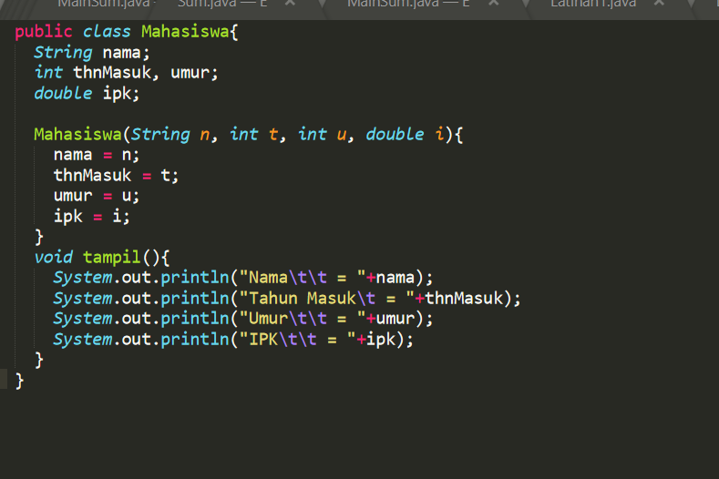
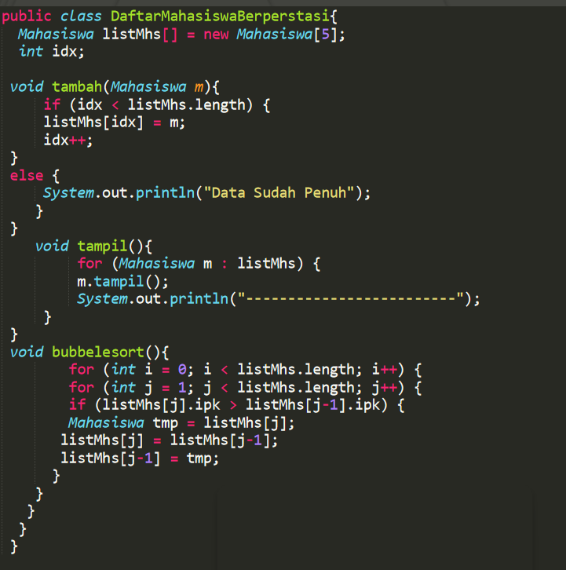
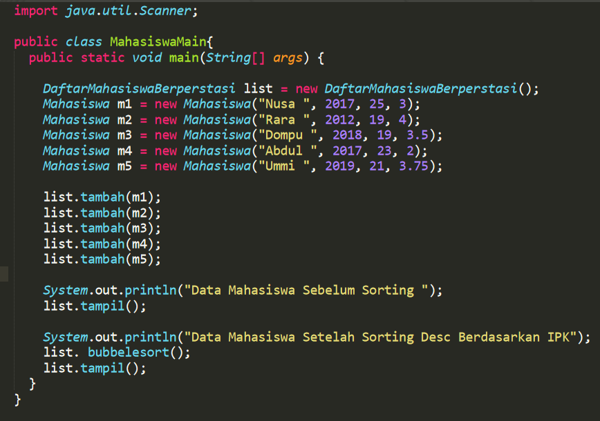

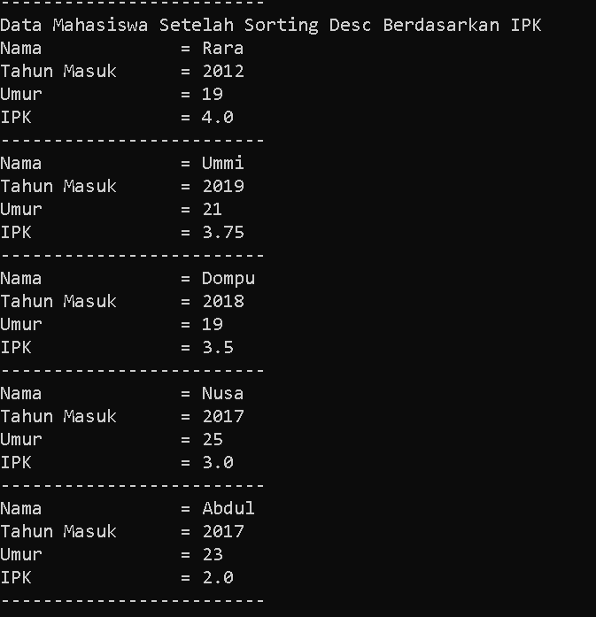

## *** Subbab 5.2.3 Pertanyaan ***

1. Terdapat di method apakah proses bubble sort?
   
   jawab:
   
   Terdapat pada method void bubbleSort()
   
   void bubbelesort(){
        for (int i = 0; i < listMhs.length; i++) {
        for (int j = 1; j < listMhs.length; j++) {
        if (listMhs[j].ipk > listMhs[j-1].ipk) {
        Mahasiswa tmp = listMhs[j];
       listMhs[j] = listMhs[j-1];
       listMhs[j-1] = tmp;
      }
    }

2. Terdapat di method apakah proses selection sort?
   
   jawab:

   Terdapat pada method void selectionSort()
    
   void selectionSort(){
      for (int i = 0; i < listMhs.length; i++) {
        int idxMin = 1;
        for (int j = i+1; j <listMhs.length-1; j++) {
          if (listMhs[j].ipk < listMhs[idxMin].ipk) {
            idxMin = j;
          }
        }

3. Apakah yang dimaksud proses swap? Tuliskan potongan
   program tersebut
   
   jawab:
   
   Proses swap adalah proses untuk menukarkan nilai.

   Mahasiswa tmp = listMhs[j]; 
   listMhs[j] = listMhs[j-1]; 
   listMhs[j-1] = tmp;

4. Di dalam method bubbleSort(), terdapat baris program
   sepertti dibawah ini Untuk apakah proses tersebut
   
   jawab:

   Untuk menyimpan index sementara.

5. Perhatikan perulangan di dalam bubbleSort() dibawah 
   ini
  
   a. Apakah perbedaan antara kegunaan perulangan i 
      dan perulangan j? 

      Perulangan i sebagai iterasi dimana nantinya tahapan bubble sort. Sedangkan 
      perulangan. j merupakan template dilakukannya pengecekan dan swap dari setiap iterasinya

   b. Mengapa syarat dari perulangan i adalah i<listMhs.
      length-1

      Yaitu merujuk pada tahapan bubble sort yang akan berulang sebanyak lisMhs
  
   c. Mengapa syarat dari perulangan j adalah j<listMhs.
      length-i ?

    Dikarenakan perulangan j merupakan bagian dari perulangan i, maka di setiap 
    iterasinya, banyak data yang akan dicek dan diswapakan selalu berkurang 1, jadi misalnya pada iterasi pertama, banyak data yang akan dihitung ataupun swap adalah sebanyak 20, pada iterasi kedua sebanyak 19, begitu seterusanya sampai iterasi ke-20yaitu sebanyak 2 data saja
   
   d. Jika banyak data di dalam listMhs adalah 50, maka    berapakali perulangan i akan berlangsung? Dan ada berapa Tahap bubble sort yang ditempuh

    Perulangan i sebanyak 49 kali, dan ada deret aritmatika penjumlahan dari 49+48+47+……+1 menghasilkan 1225 tahapan bubble sort

## *** Subbab 5.3.1. Percobaan2 ***

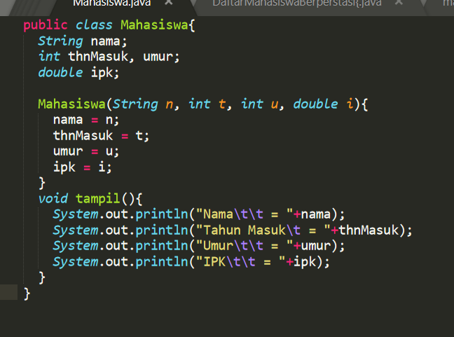
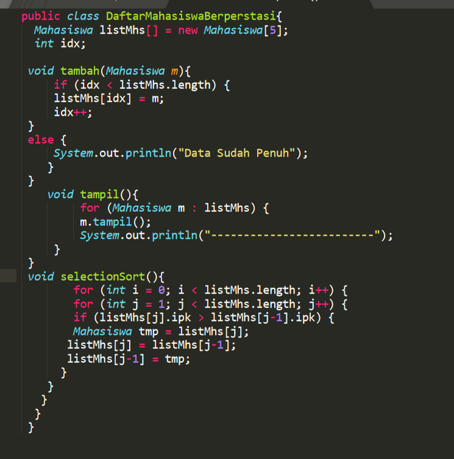
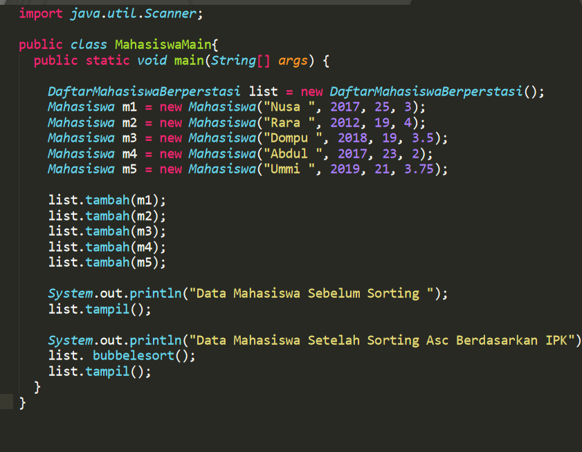
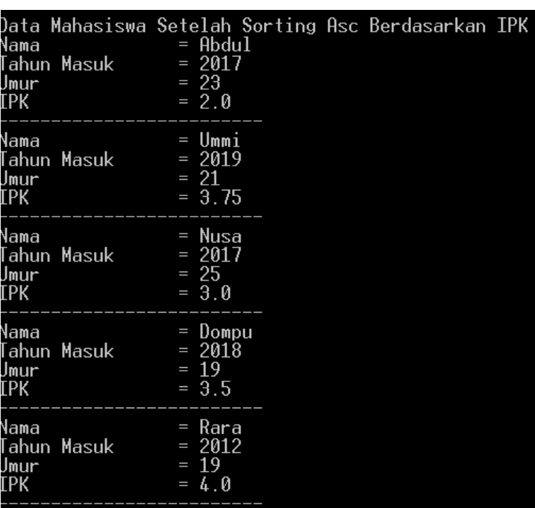
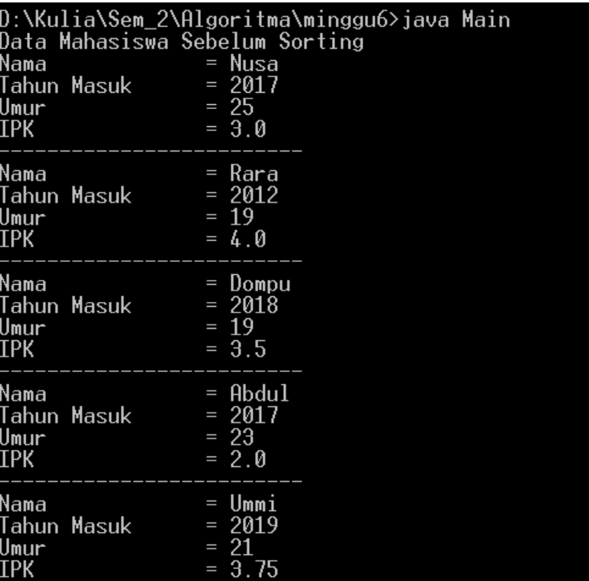

## *** Subbab 5.4.2 Pertanyaan *** 

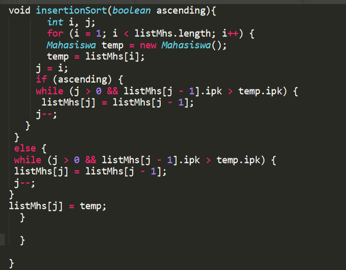

### LATIHAN PRAKTIKUM 1

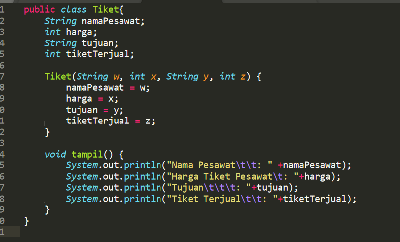
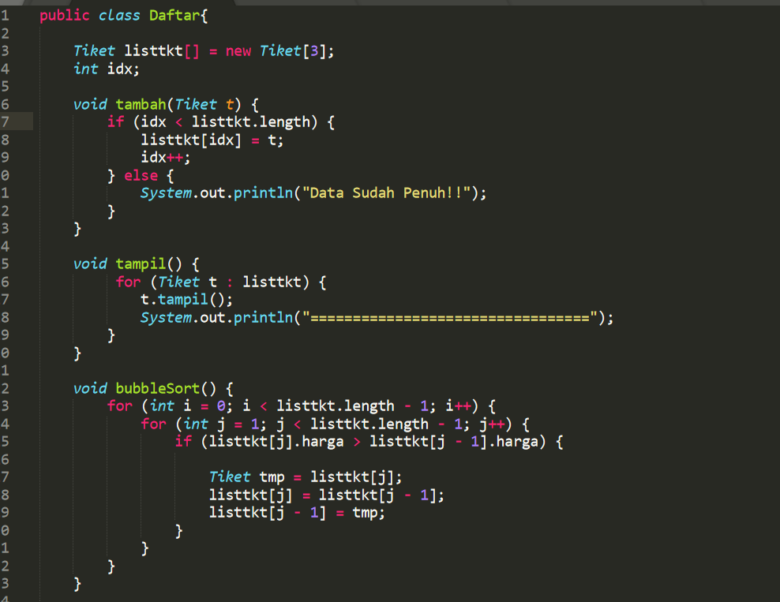
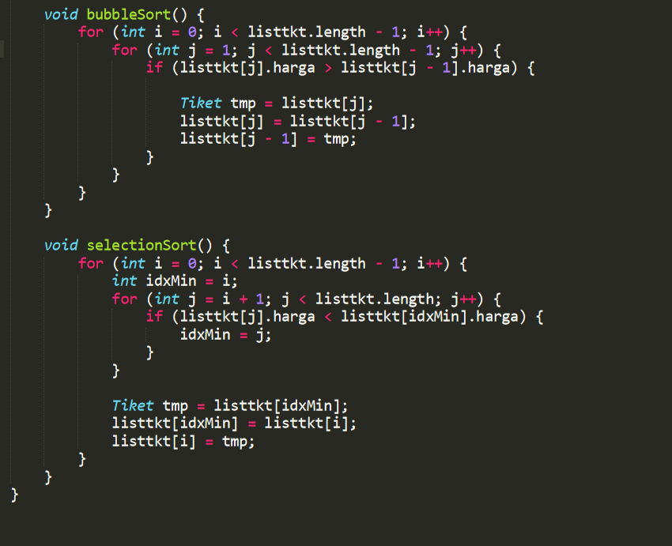
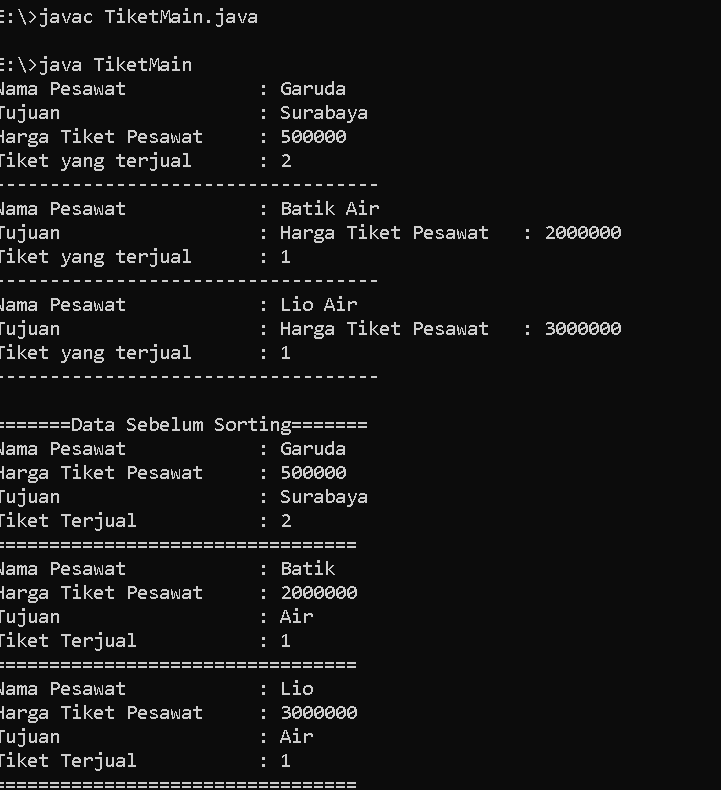
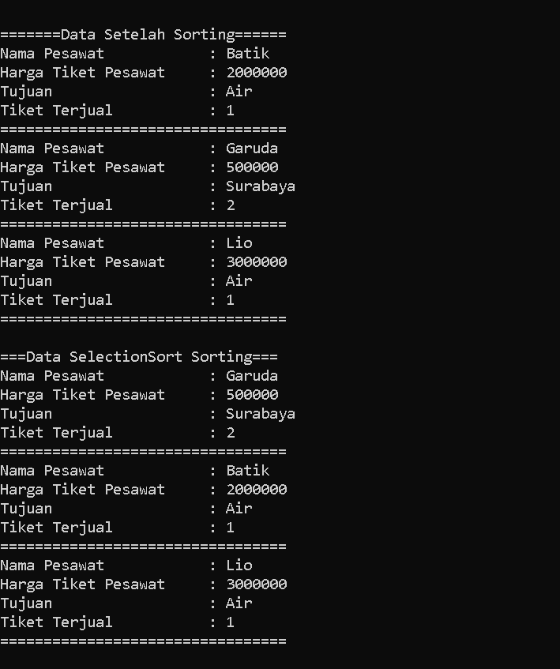

