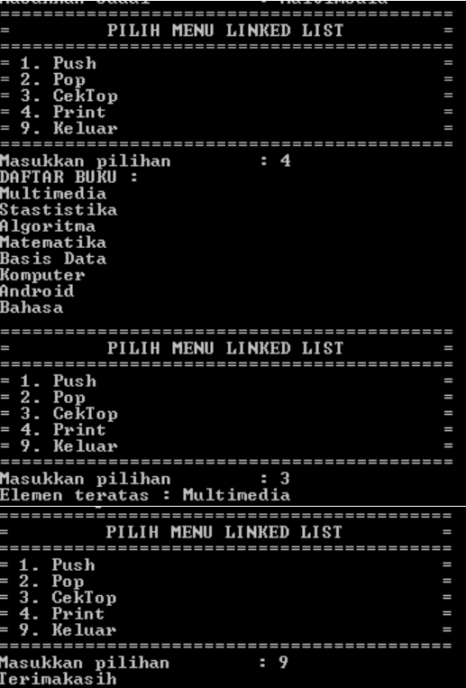
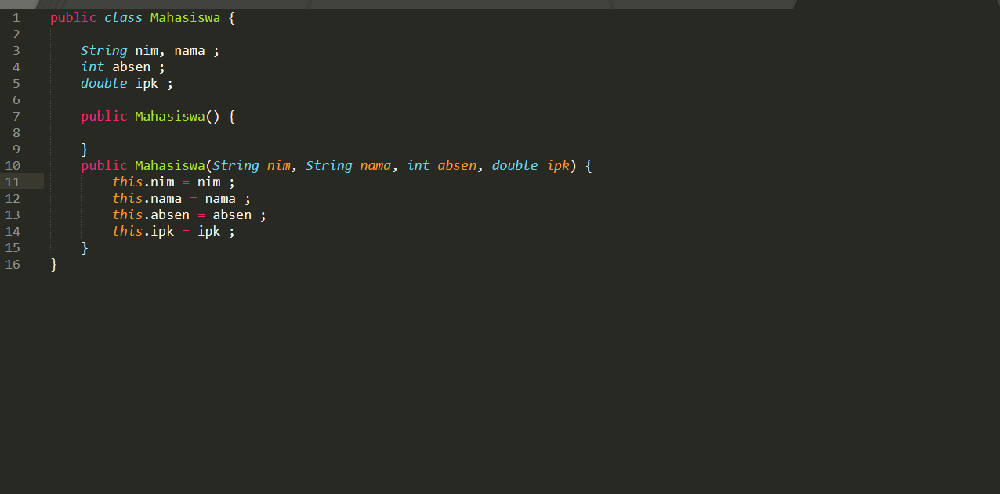

##laporan Praktikum pertemuan 11
### Nama  : Trisinus Gulo
### NIM   : 2141720035
### Kelas : TI-1G
### Absen : 28

## **2.1 Pembuatan Single Linked List**

## **2.1.2 Pertanyaan**

1. Mengapa hasil compile kode program di baris pertama    menghasilkan “Linked List Kosong”?

     jawab:
     
     Karena class main pada baris pertama langsung di print

2. Pada step 10, jelaskan kegunaan kode berikut:
   
   ndInput.next = head;
     
   head = ndInput;
   
   jawab:

   ndInput.next penambahan dari (addFirst), ketika kondisi awal node kosong head dan tail akan menunjuk ke node input lalu jika linked list telah ada node maka: Next pada node 
   input menunjuk node yang ditunjuk oleh head, dan head menunjuk ke node.

3. Perhatikan class SingleLinkedList, pada method insertAt Jelaskan kegunaan kode berikut

   if (ndInput.next == null) tail = ndInput;

   jawab:

   Kode berikut menyeleksi apakah temp.net itu sama dengan null. Jika iya tail pada (posisi akhir lingked list) merupakan temp.temp merupakan head atau psosisi awal. Fungsinya untuk mengeksekusi tempnya null. tidak untuk mencari posisi apakah temp sudah termasuk tail dari lingked list.

## **2.2 Modifikasi Elemen pada Single Linked List**

## **2.2.3 Pertanyaan**

1. Mengapa digunakan keyword break pada fungsi remove? Jelaskan!

   jawab:

   Agar tidak terjadi error, karena break digunakan dalam 1x remove.

2. Jelaskan kegunaan kode dibawah pada method remove

   if (temp.data == key) {
  
   temp.next=temp.next.next;

   jawab:

   Apabila temp melanjutkan ke data sama dengan key, maka temp akan melanjutkan seterusnya. Berfungsi untuk mengeksekusi apabila temp berjalan dan merupakan key, maka temp akan berjalan selanjutnya.

3. Apa saja nilai kembalian yang dapat dikembalikan pada method indexOf? Jelaskan maksud masing-masing kembalian tersebut!

   jawab:

   Return -1, dan return index. Pada return -1 berfungsi apabila temp nya merupakan null, maka akan di return -1. Dengan maksud berjalan mundur untuk mengurangi index dengan -1. Jika tidak null maka return index, yang dimulai dari 0.

   
## **TUGAS PRAKTIKUM**

1. Buat method insertBefore untuk menambahkan node sebelum keyword yang diinginkan

   
   
   
   
   
   
   
   

2. Implementasikan ilustrasi Linked List Berikut. Gunakan 4 macam penambahan data yang telah dipelajari sebelumnya untuk menginputkan data.

   
   
   
   
   

3. Buatlah Implementasi Stack berikut menggunakan Single Linked List
    
   
   
   
   

4. Buatlah implementasi program antrian untuk mengilustasikan mahasiswa yang sedang meminta tanda tangan KRS pada dosen DPA di kampus pada tugas jobsheet 8 menggunakan LinkedList.
Implementasikan Queue pada antrian mahasiswa denganmenggunakan konsep LinkedList

   
   
   
   
   
   
   
   
   