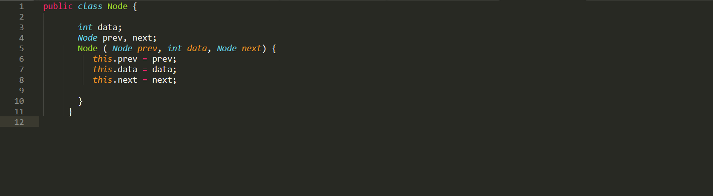
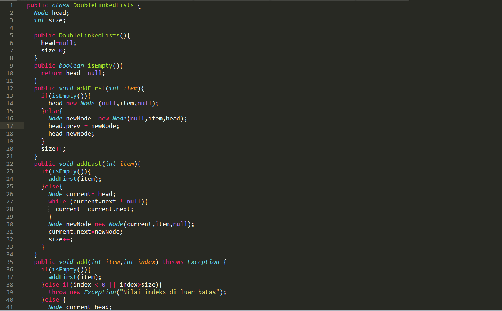
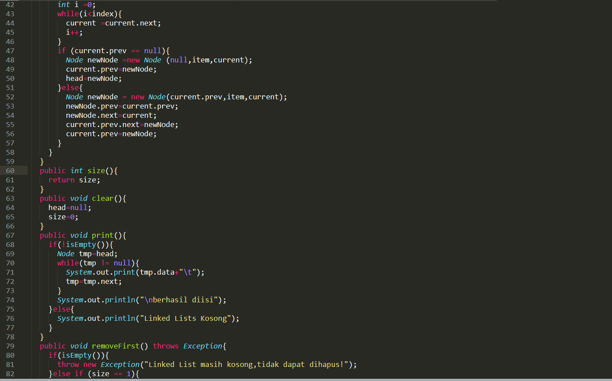
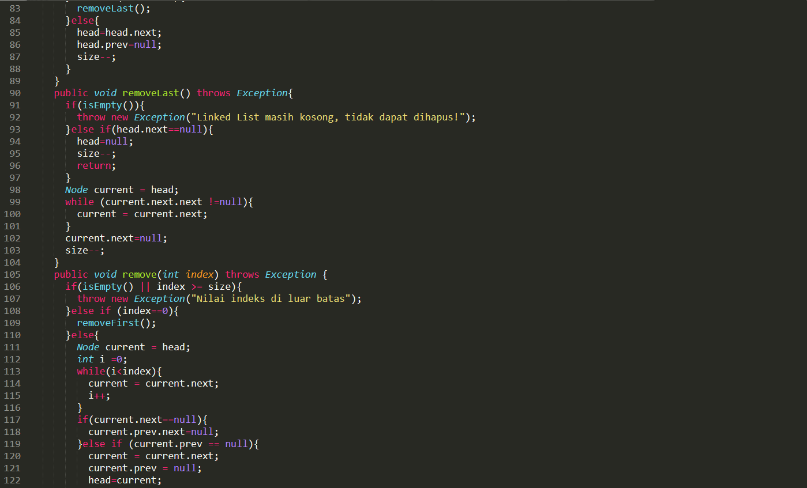
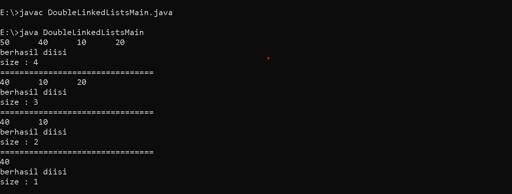
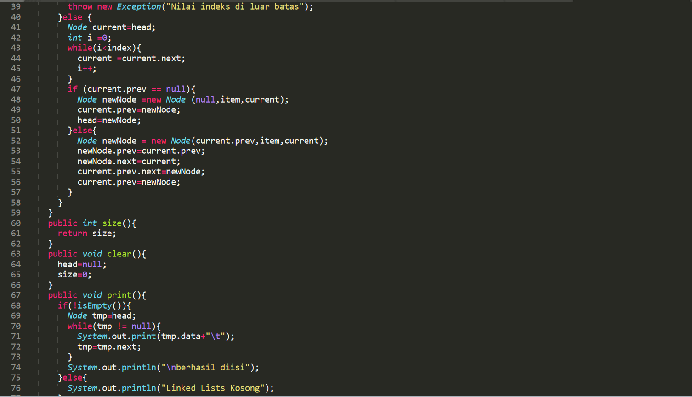
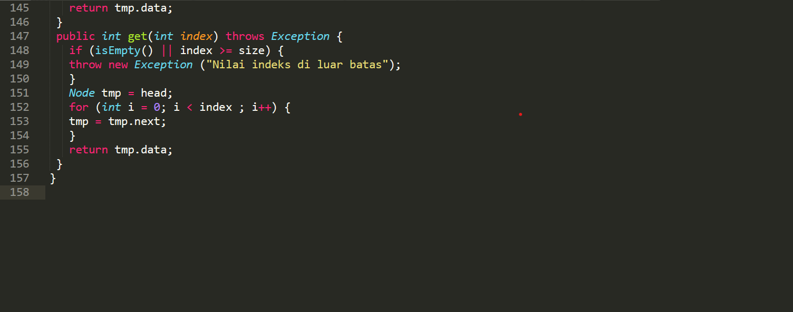

##laporan Praktikum pertemuan 12
### Nama  : Trisinus Gulo
### NIM   : 2141720035
### Kelas : TI-1G
### Absen : 28

## **12.2.1 Praktikum 1**

## **12.2.3 Pertanyaan Praktikum 1**

1. Jelaskan perbedaan antara single linked list dengan double linked lists!
   
   jawab

   Single Linked List merupakan linked list yang memiliki satu variabel pointer untuk menunju ke node selanjutnya, sedangkan Double Linked List merupakan linked list yang memiliki dua variabel pointer, pointer yang menunjuk ke node selanjutnya dan pointer yang menunjuk ke node sebelumnya.

2. Perhatikan class Node, didalamnya terdapat atribut next dan prev. Untuk apakah atribut tersebut?
   
   jawab

   Next = Pointer next yang menunjuk ke elemen berikutnya.
   
   Prev = Pointer prev yang menunjuk ke elemen sebelumnya.

3. Perhatikan konstruktor pada class DoubleLinkedLists. Apa kegunaan inisialisasi atribut head dan size seperti pada gambar berikut ini?

   
        public DoubleLinkedLists(){
    
        head=null;
    
        size=0;
    
    }

    jawab 

    Inisiasi pertama yang menunjukkan bahwa double linked list tersebut masih kosong.

4. Pada method addFirst(), kenapa dalam pembuatan object dari konstruktor class Node prev dianggap sama dengan null?
Node newNode = new Node(null, item, head);
   
   jawab

   Karena belum ada isinya dan kondisi pointer prev menunjuk ke null atau tidak menunjuk kemanapun.

5. Perhatikan pada method addFirst(). Apakah arti statement head.prev = newNode ?
   
   jawab: Node yang menandakan sudah berisi data dan Menunjukkan bahwa posisi head pada node sebelumnya adalah sebagai node baru.

6. Perhatikan isi method addLast(), apa arti dari pembuatan object Node dengan mengisikan  parameter prev dengan current, dan next dengan null?
Node newNode = new Node(current, item, null);

   jawab

   New node yang baru prev akan menunjuk ke current dan data data yang ada akan next menunjuk ke null.

## **12.3.2 Praktikum 2**

## **12.3.3 Pertanyaan Praktikum 2**

1. Apakah maksud statement berikut pada method removeFirst()?

    head = head.next;

    head.prev = null;

    jawab

    Ketika dilakukan penghapusan pada node di index pertama maka posisi headakan berpindah ke posisi node selanjutnya dan pointer sebelumnya pada head bernilai null.

2. Bagaimana cara mendeteksi posisi data ada pada bagian akhir pada method removeLast()?

   jawab 

   Ketika nilai current sudah kososng atau null maka current tersebut akan di remove dan current null akan di decrement.

3. Jelaskan alasan potongan kode program di bawah ini tidak cocok untuk perintah remove

   jawab 

   Karena tidak jelas pointernya menunjuk kemana, sehingga tidak cocok untuk perintah remove.

4. Jelaskan fungsi kode program berikut ini pada fungsi remove!

   jawab 

   pointer next pada current/node sebelumnya akan menunjuk ke current/node selanjutnya, dan pointer prev pada current/node selanjutnya akan menunjuk kecurrent node sebelumnya.

## **12.4 Praktikum 3**

## **12.5 Pertanyaan Praktikum 3**

1. Jelaskan method size() pada class DoubleLinkedLists!

   jawab 

   method size() merupakan method yang akan mereturn nilai 0, apabila linked list dalam kondisi kosong.

2. Jelaskan cara mengatur indeks pada double linked lists supaya dapat dimulai dari indeks ke 1!
 
   jawab

   ketika ingin mengatur indeks pada double linked list agar dapat dimulain dari indeks ke-1, maka kita harus mengganti inisialisasi dari variabel i yang semula 0 menjadi 1. Yang terletak pada method get() di class DoubleLinkedLists.

3. Jelaskan perbedaan karakteristik fungsi Add pada Double Linked Lists dan Single Linked Lists!

   jawab

   Pada SLL fungsi add hanya memperhatikan letak datanya, dan data next. Pada DLL fungsi add agar lebih kompleks dimana harus memperhatikan nilai next, current dan prev dari data.

4. Jelaskan perbedaan logika dari kedua kode program di bawah ini!

   jawab

    A. ketika menjalankan method isEmpty() maka akan dicek size dan linked list, jika sizenya bernilai 0, maka akan di return true, sedangkan jika salah maka akan direturn false.

    B. Ketika akan menjalankan method isEmpty(), maka akan dicek dan direturn 
    nilai dari head == null. Ketika head bernilai kosong maka akan direturn true, namun ketika head tidak kosong maka akan di return false

## **TUGAS PRAKTIKUM**

1. Buat program antrian vaksinasi menggunakan queue berbasis double linked list sesuai ilustrasi dan menu di bawah ini! (counter jumlah antrian tersisa di menu cetak(3) dan data orang yang telah divaksinasi di menu Hapus Data(2) harus ada)Ilustrasi ProgramMenu Awal dan Penambahan Data.

    
    
    
    
    
    

2.  Buatlah program daftar film yang terdiri dari id, judul dan rating menggunakan double linked lists, bentuk program memiliki fitur pencarian melalui ID Film dan pengurutan Rating secara descending. Class Film wajib diimplementasikan dalam soal ini.Contoh Ilustrasi ProgramMenu Awal dan Penambahan Data.
   
    
    
    
    
    
    
    
    
    
    
    
    

    