##laporan Praktikum pertemuan 12
### Nama  : Trisinus Gulo
### NIM   : 2141720035
### Kelas : TI-1G
### Absen : 28

## **12.2.1 Praktikum 1**

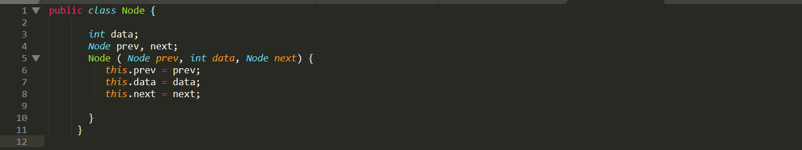
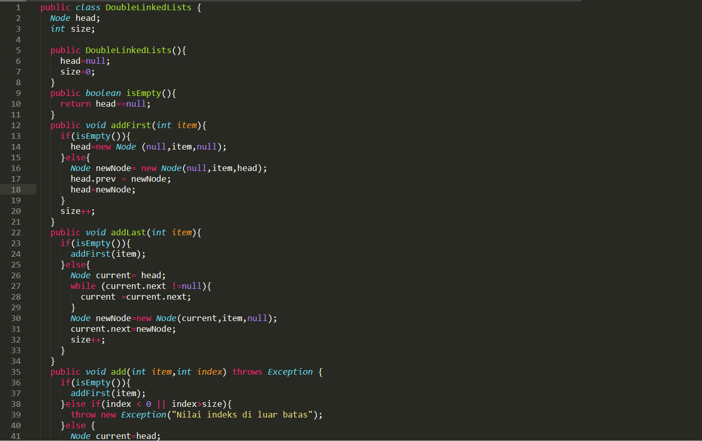
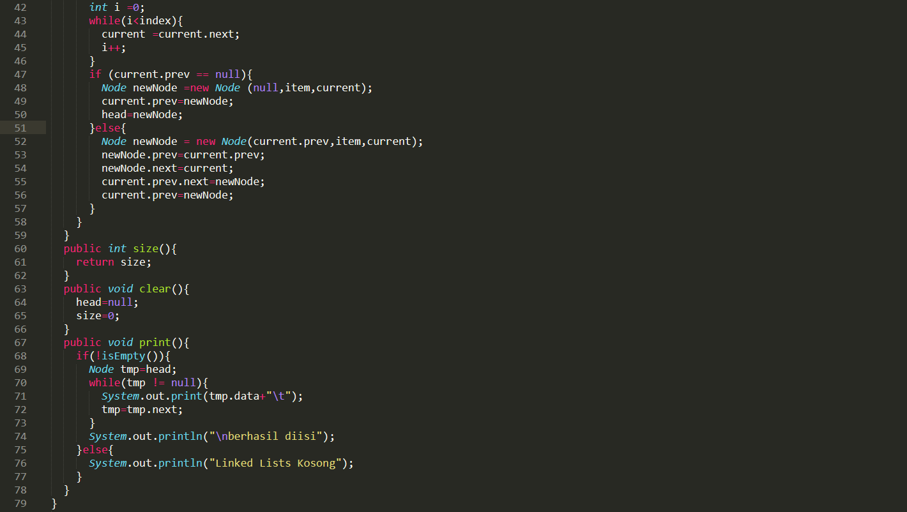
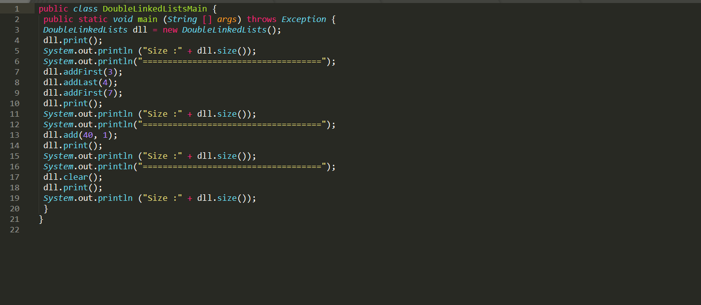
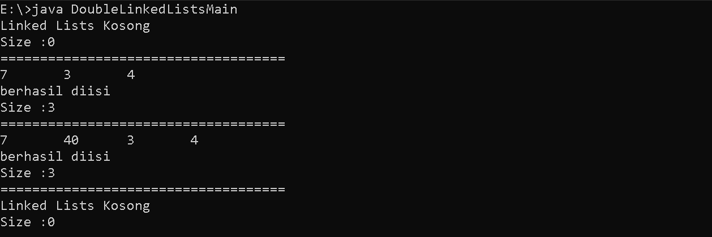

## **12.2.3 Pertanyaan Praktikum 1**

## **12.3.2 Praktikum 2**

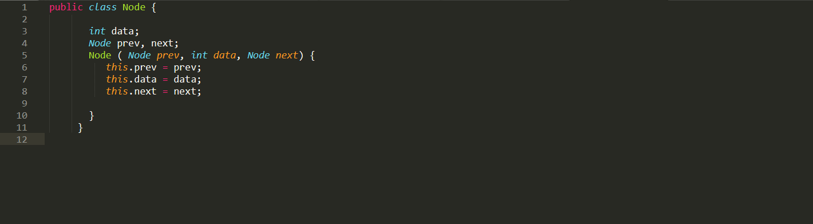
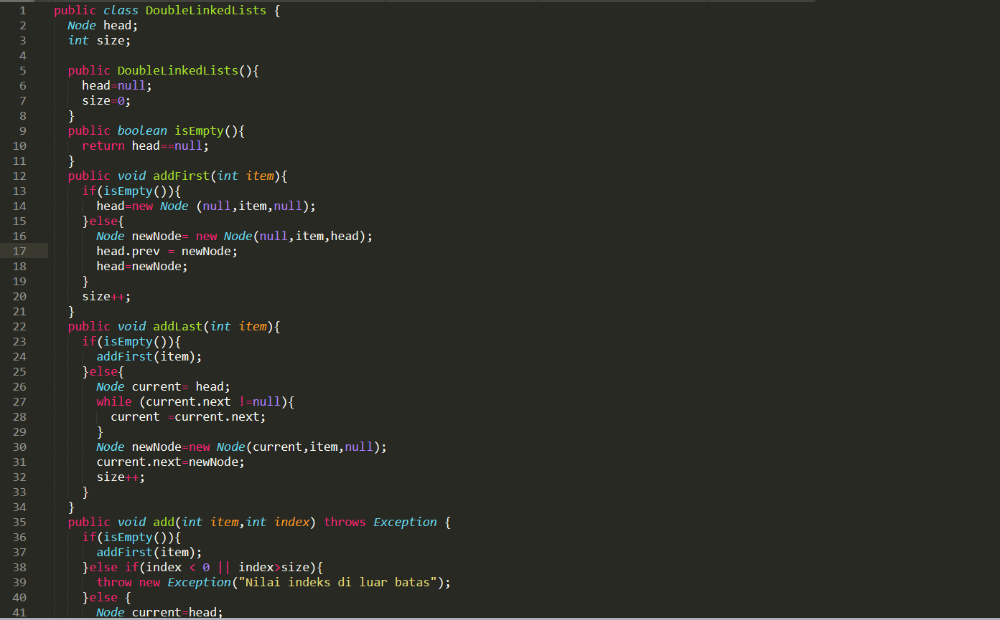
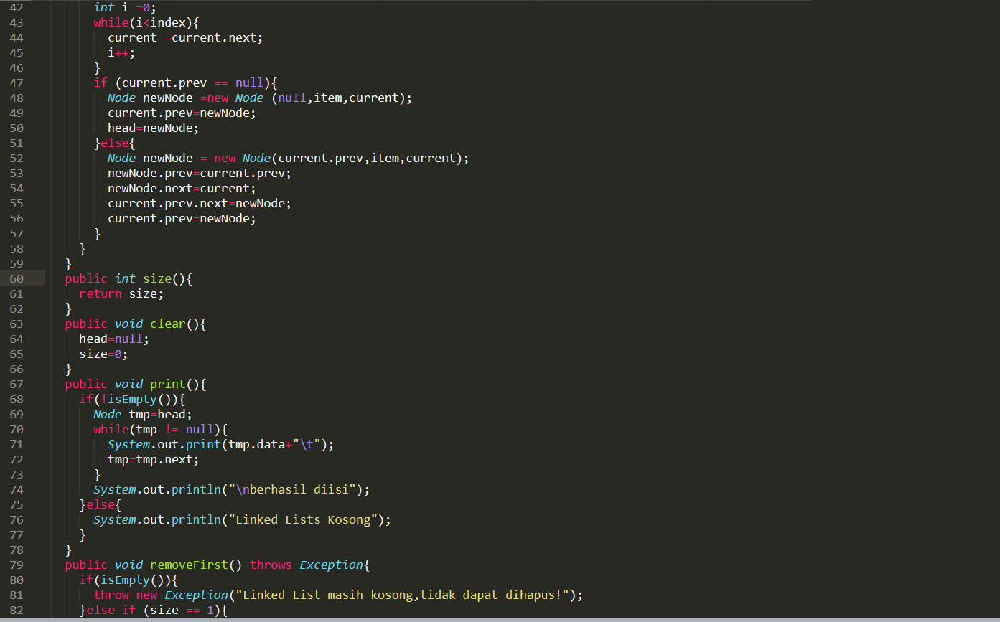
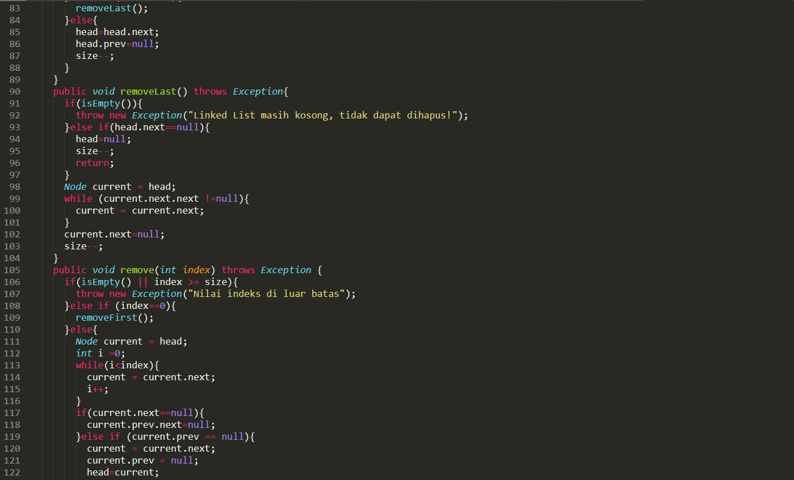

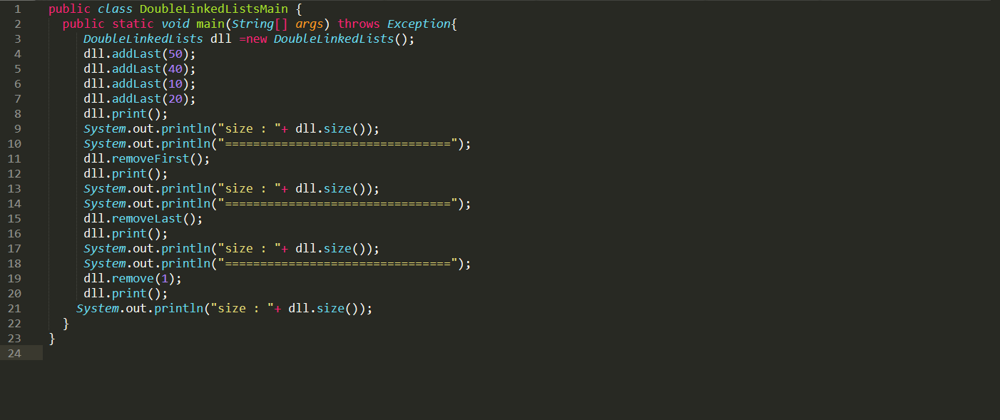
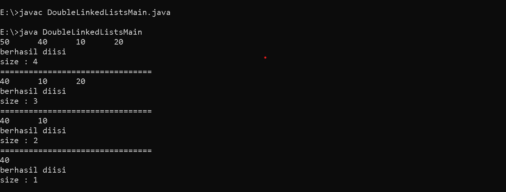

## **12.3.3 Pertanyaan Praktikum 2**

## **12.4 Praktikum 3**
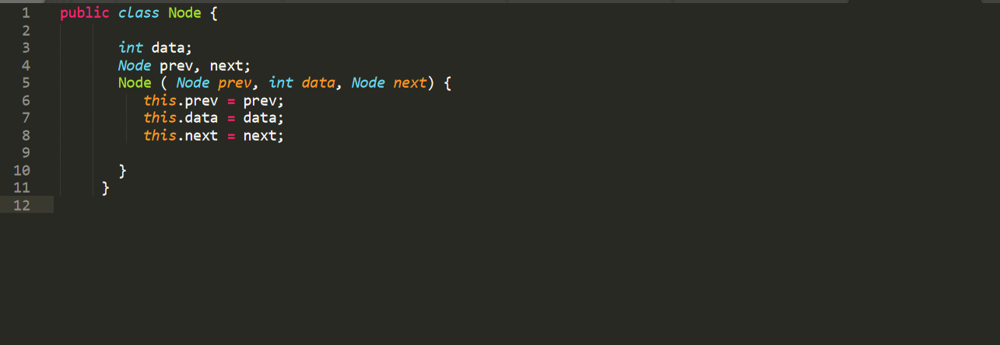
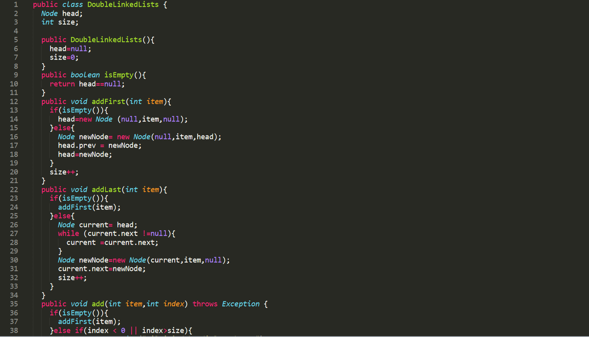
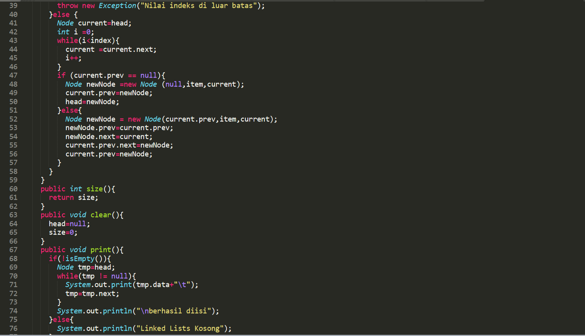
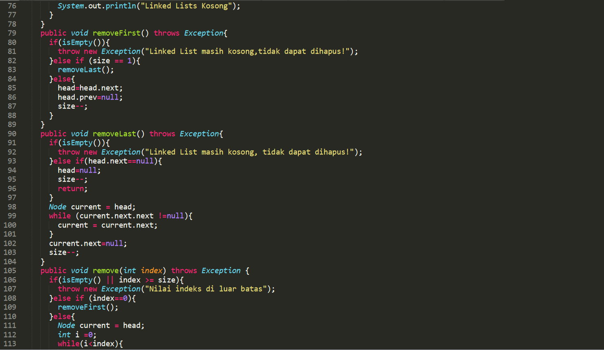
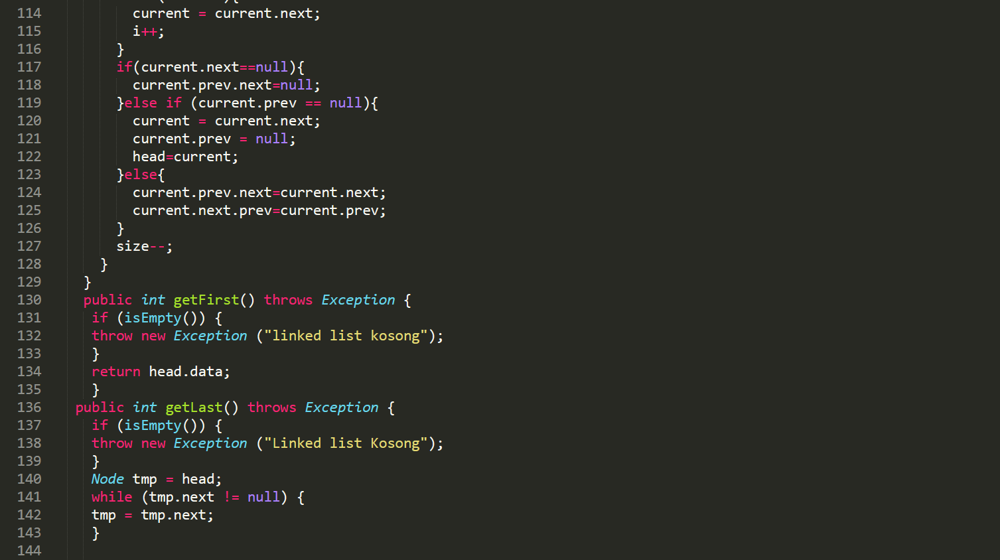
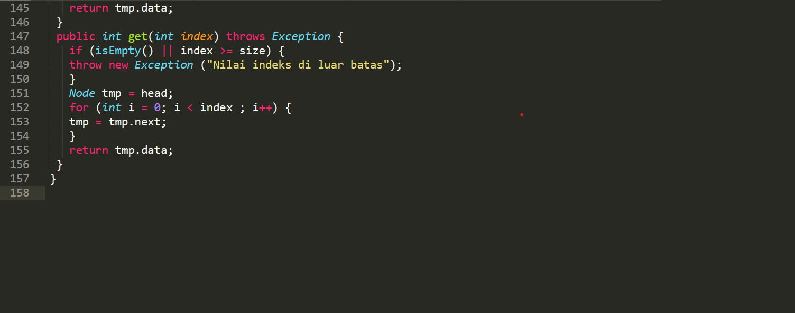
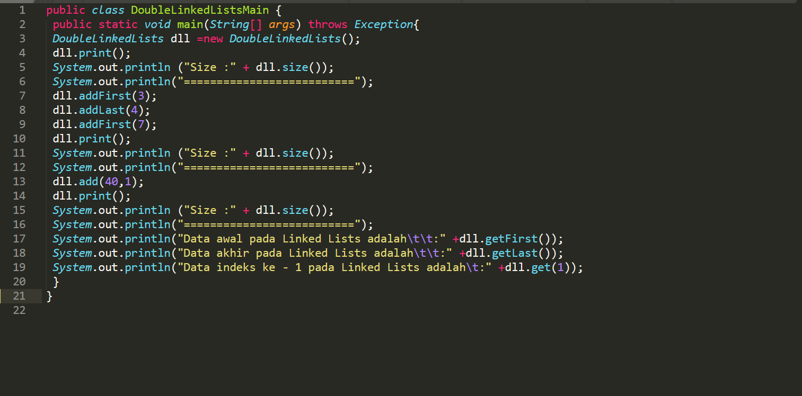
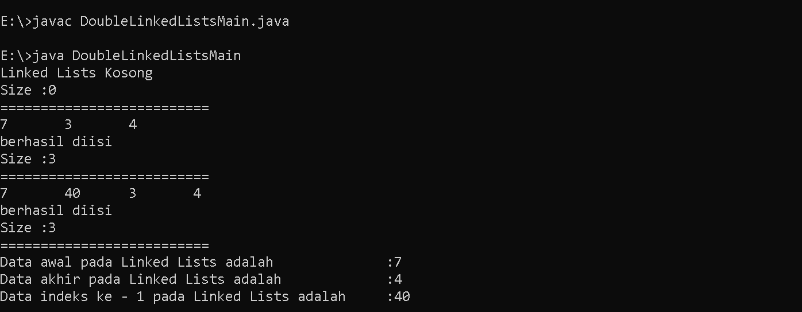

