##laporan Praktikum Pertemuan 13
### Nama  : Trisinus Gulo
### NIM   : 2141720035
### Kelas : TI-1G
### Absen : 28

## **2.1 Implementasi Binary Search Tree menggunakan Linked List Praktikum1**

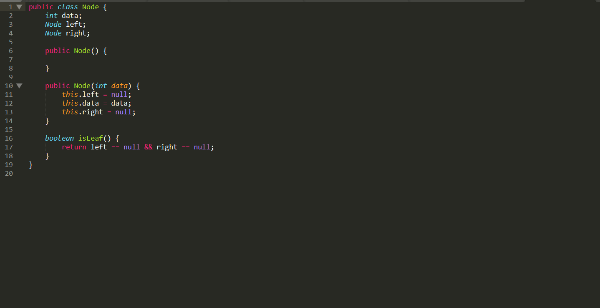
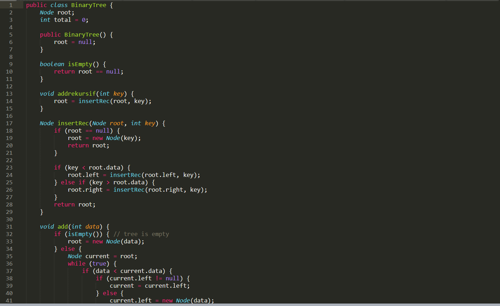
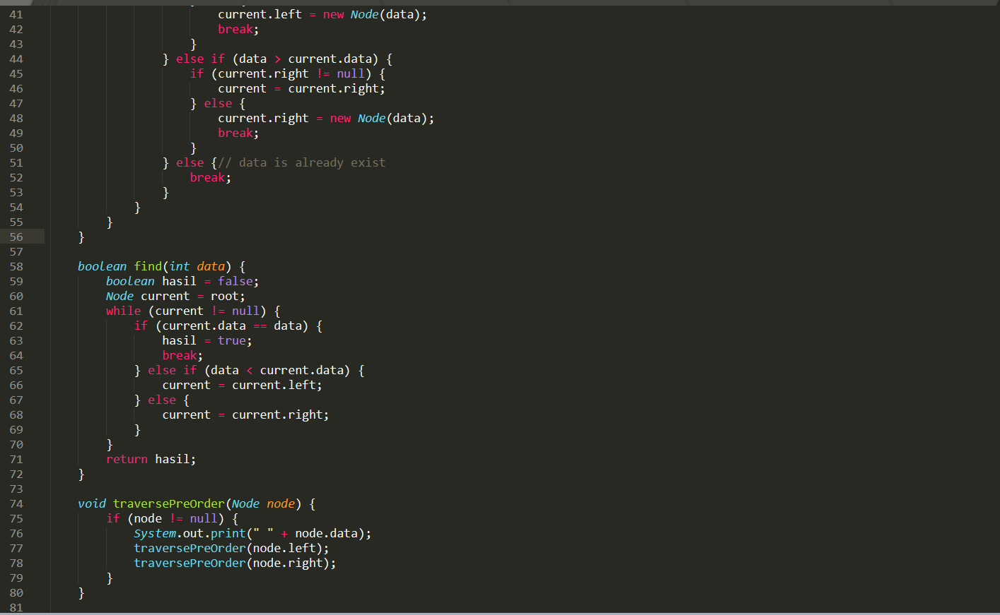
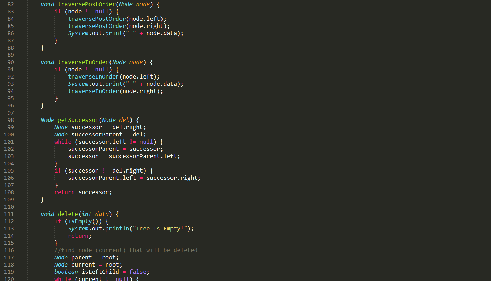
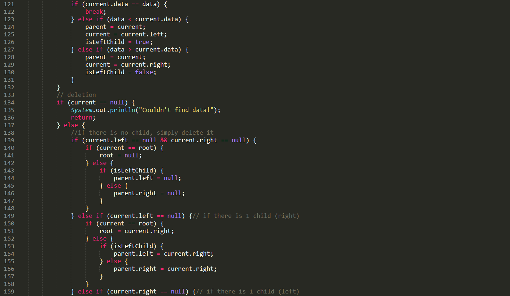
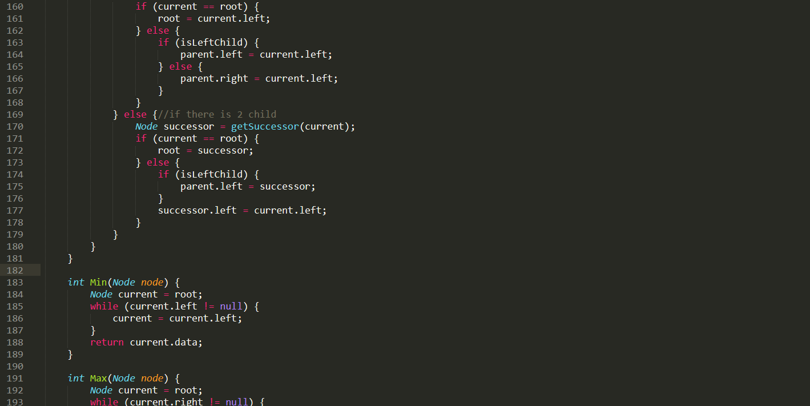
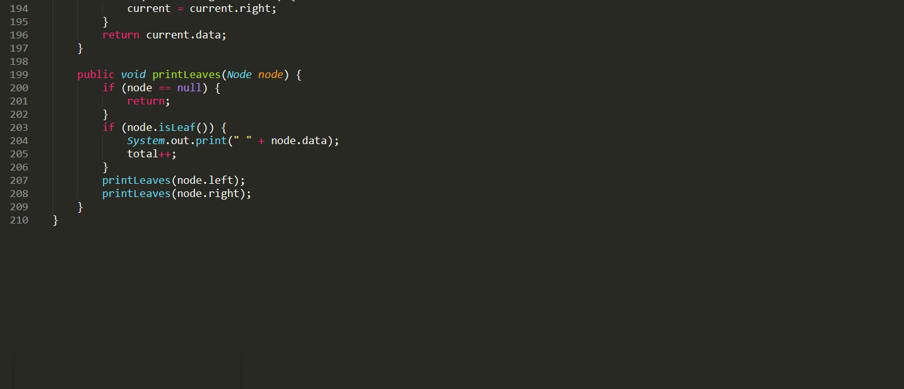
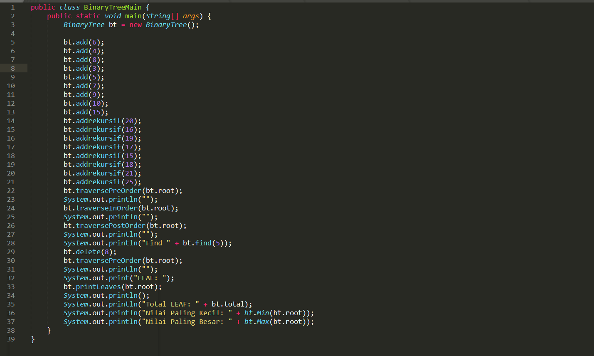
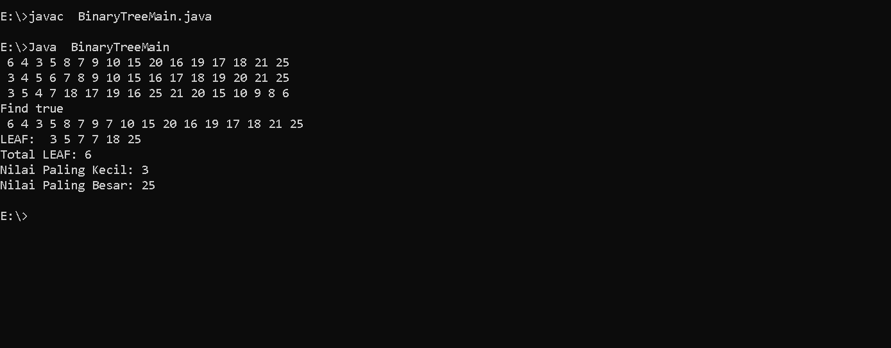

## **2.2 Pertanyaan Praktikum1**

1. Mengapa dalam binary search tree proses pencarian data bisa lebih efektif dilakukan dibanding binary tree biasa?
   
   jawab:

   Dalam binary, search tree data terlebih dahulu diurutkan sehingga pencarian data bisa lebih efektif.

2. Untuk apakah di class Node, kegunaan dari atribut left dan right?

3. a. Untuk apakah kegunaan dari atribut root di dalam class   BinaryTree?
    
    jawab : untuk menyimpan data yang pertama kali masuk atau juga menetukian nilai paling atas 

   b. Ketika objek tree pertama kali dibuat, apakah nilai dari root?

    jawab : null

4. Ketika tree masih kosong, dan akan ditambahkan sebuah node baru, proses apa yang akan terjadi?

   jawab:

   proses penginputan node ke dalam root

5. Perhatikan method add(), di dalamnya terdapat baris program seperti di bawah ini. Jelaskan secara detil untuk apa baris program tersebut?

     if(data<current.data){

        if(current.left!=null){

        current = current.left;

      }else{

      current.left = new Node(data);

      break;

    }

      jawab :

      Apabila data yang dimasukkan nilainya lebih kecil dari data yang sudah adamaka current left bersifat tidak kosong, jika atribut current akan menyimpan nilai dari current left, maka akan menjadi parent dari data yang baru dimasukkan.

## **2.3Implementasi binary tree dengan array Praktikum2**

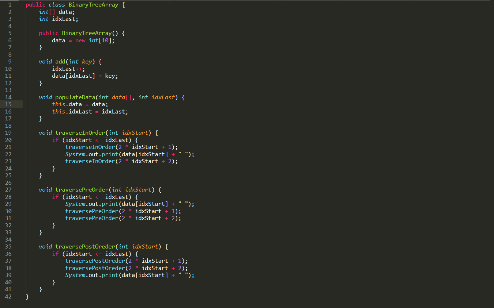
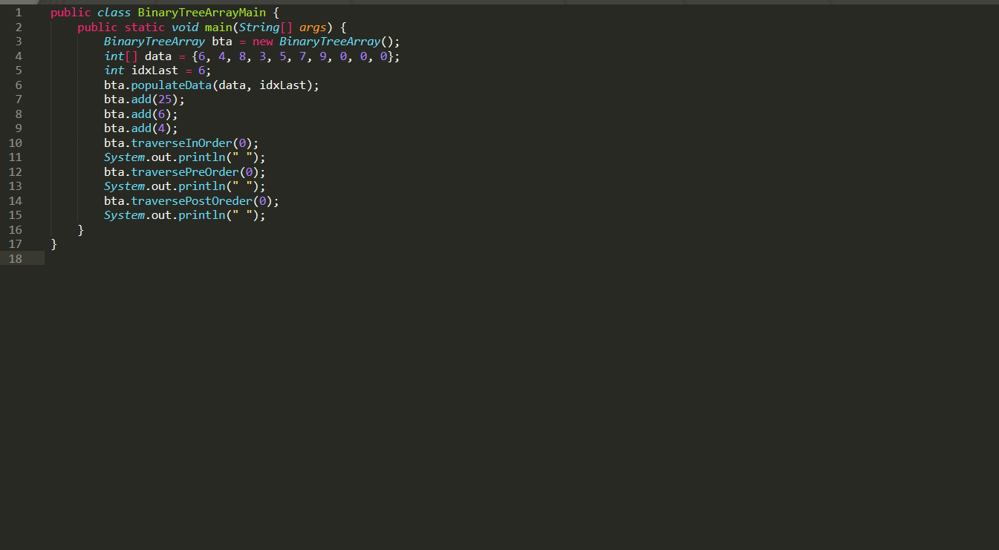
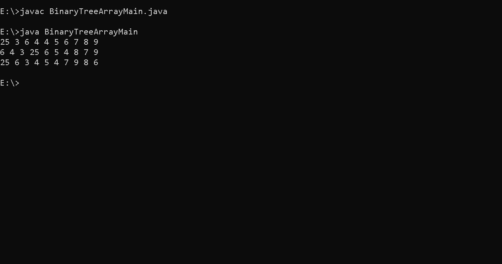

## **2.4 Pertanyaan Praktikum2**

1. Apakah kegunaan dari atribut data dan idxLast yang ada di class BinaryTreeArray?

   jawab:

   Digunakan untuk menyimpan data array, sedangkan idxLast sebagai untuk menyimpan batas index

2. Apakah kegunaan dari method populateData()?

   jawab:

   Untuk menginisialisasi atribut data dan idxlast.

3. Apakah kegunaan dari method traverseInOrder()?

   jawab:

   untuk mencetak semua node-node.

4. Jika suatu node binary tree disimpan dalam array indeks 2, maka di indeks berapakah posisi left child dan rigth child masin-masing?

   jawab:

   Left child = indeks ke 2(2*i+1) -> (2*2+1) = 5.

   Right child = indeks ke (2*i+2) -> (2*2+2) = 6.

5. Apa kegunaan statement int idxLast = 6 pada praktikum 2 percobaan nomor 4?

   jawab:

   Untuk menunjukkan batas indeks 6.

## **Tugas Praktikum**

1. Buat method di dalam class BinaryTree yang akan menambahkan node dengan cara rekursif.

    
     
     Fungsi Main

    

2. Buat method di dalam class BinaryTree untuk menampilkan nilai paling kecildan yang paling besar yang ada di dalam tree.

    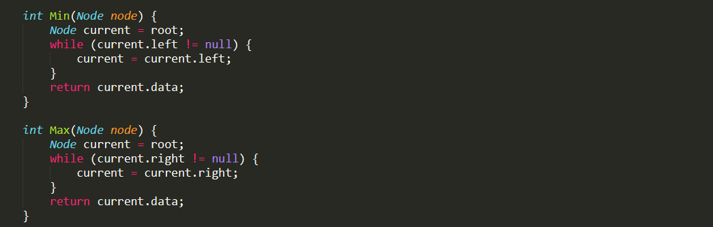

    Fungsi Main

    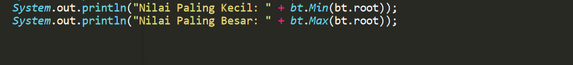

3. Buat method di dalam class BinaryTree untuk menampilkan data yang ada di leaf.

4. Buat method di dalam class BinaryTree untuk menampilkan berapa jumlah leaf yang ada di dalam tree.

   jawaban No 3 & 4

   
    
     Fungsi Main

   

5. Modifikasi class BinaryTreeArray, dan tambahkan : 
• method add(int data) untuk memasukan data ke dalam tree 

   
        void add(int key) {

                idxLast++;

        data[idxLast] = key;

    }

• method traversePreOrder() dan traversePostOrder(

           void traversePreOrder(int idxStart) {

                 if (idxStart <= idxLast) {

            System.out.print(data[idxStart] + " ");

            traversePreOrder(2 * idxStart + 1);

            traversePreOrder(2 * idxStart + 2);

        }

    }

    void traversePostOreder(int idxStart) {

        if (idxStart <= idxLast) {
            
            traversePostOreder(2 * idxStart + 1);

            traversePostOreder(2 * idxStart + 2);

            System.out.print(data[idxStart] + " ");

        }

    }

}
