##laporan Praktikum pertemuan 15
### Nama  : Trisinus Gulo
### NIM   : 2141720035
### Kelas : TI-1G
### Absen : 28

## **16.2. Kegiatan Praktikum 1**

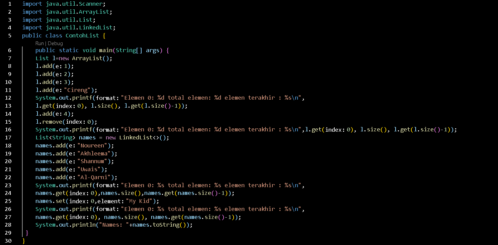
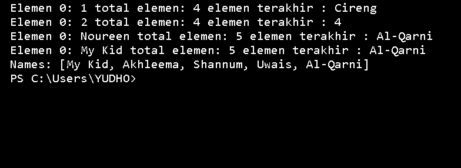

## **16.3. Pertanyaan Praktikum1**

1. Perhatikan baris kode 25-36, mengapa semua jenis data bisa ditampung ke dalam sebuah Arraylist?

    jawab : Karena pada baris 25-36 itu tidak ada aturan tipe data tertentu, sehingga bisa menyimpan semua tipe data.

2. Modifikasi baris kode 25-36 seingga data yang ditampung hanya satu jenis atau spesifik tipe tertentu!

    jawab:

        List l=new ArrayList();

        l.add(1);

        l.add(2);

        l.add(3);
        
        l.add(4);

3. Ubah kode pada baris kode 38 menjadi seperti ini
    
    jawab:

    LinkedList<String> names = new LinkedList<>();

4. Tambahkan juga baris berikut ini, untuk memberikan perbedaan dari tampilan yang sebelumnya
   
   jawab:

    names.push("Mei - Mei");

    System.out.printf("Elemen 0 : %s total elemen : %s elemen 

    terakhir : %s\n",

    names.getFirst(), names.size(),names.getLast());
    
    System.out.println("Names : "+names.toString())
    
5. Dari penambahan kode tersebut, silakan dijalankan dan apakah yang dapat Anda jelaskan!

    jawab:

    

## **16.4. Kegiatan Praktikum2**

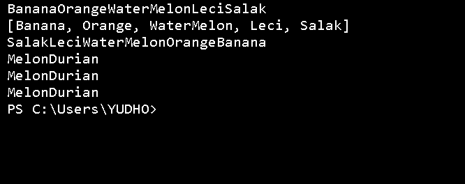

## **16.5 Pertanyaan Praktikum2**

1. Apakah perbedaan fungsi push() dan add() pada objek fruits?
   
   jawab: Fungsi push() dan add() pada objek tersebut sama-sama digunakan untuk menambah data. Hanya saja fungsi push() itu bisa digunakan di interface Stack saja

2. Silakan hilangkan baris 43 dan 44, apakah yang akan terjadi? Mengapa bisa demikian?
   
   jawab: Baris yang menampilkan melon dan durian otomatis menghilang.

   

3. Jelaskan fungsi dari baris 46-49?

   jawab:

   Baris 46 adalah sebagai inisialisasi dan set aturan perulangan
   Baris 47 adalah pembuatan variabel fuit dan inisialisasinya yaitu it.next()
   Baris 48 sebagai pencetakan variabel fruit sesuai urutan ditambahkannya data.

4. Silakan ganti baris kode 25, Stack<String> menjadi List<String> dan apakah yang terjadi? Mengapa bisa demikian?

    jawab :

    Jika Stack dirubah menjadi List, maka kan terjadi pesan error. Karena pada class tersebut belum terdapat interface List yang berupa List, mengingat sebelumnya interface List yang dikenalkan pada class yang bersangkutan adalah Stack saja.

5. Ganti elemen terakhir dari dari objek fruits menjadi Strawberry
   
    jawab:

    
    

6. Tambahkan 3 buah seperti Mango,guava, dan avocado kemudian dilakukan sorting!

    jawab:

    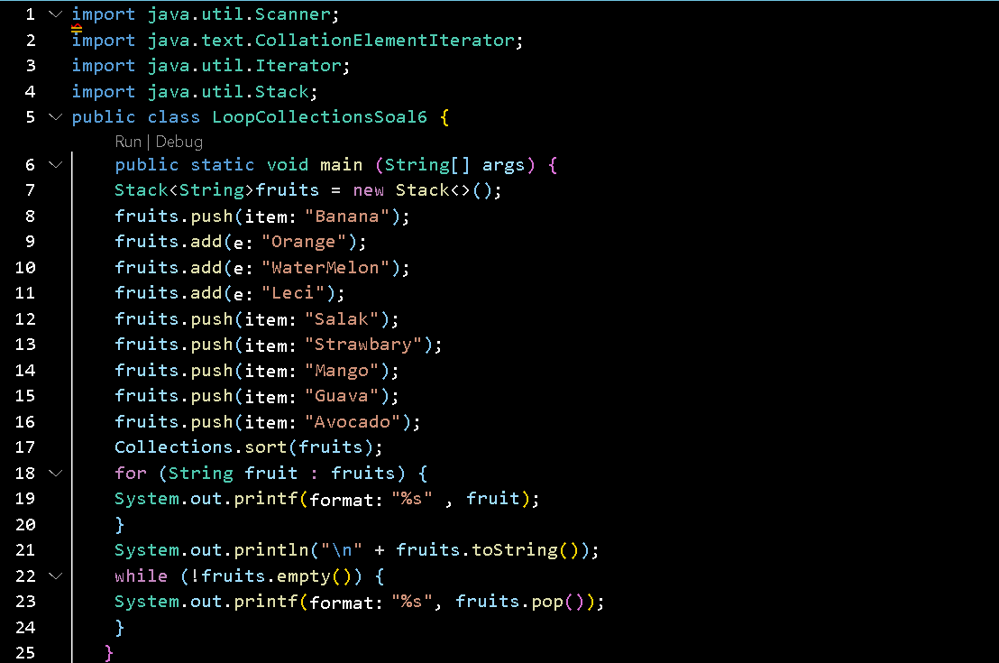
    
   

## **16.5. Kegiatan Praktikum 3**

## **16.6 Pertanyaan Praktikum3**

1. Pada fungsi tambah() yang menggunakan unlimited argument itu menggunakan konsep apa? Dan kelebihannya apa?
   
   jawab: Menggunakan Kelebihannya yaitu dapat mengambil argument tanpa batas tertentu dan memiliki parameter lebih dari satu.sehingga bisa menambah data sekaligus

2. Pada fungsi linearSearch() di atas, silakan diganti dengan fungsi binarySearch() dari collection!

   jawab:

   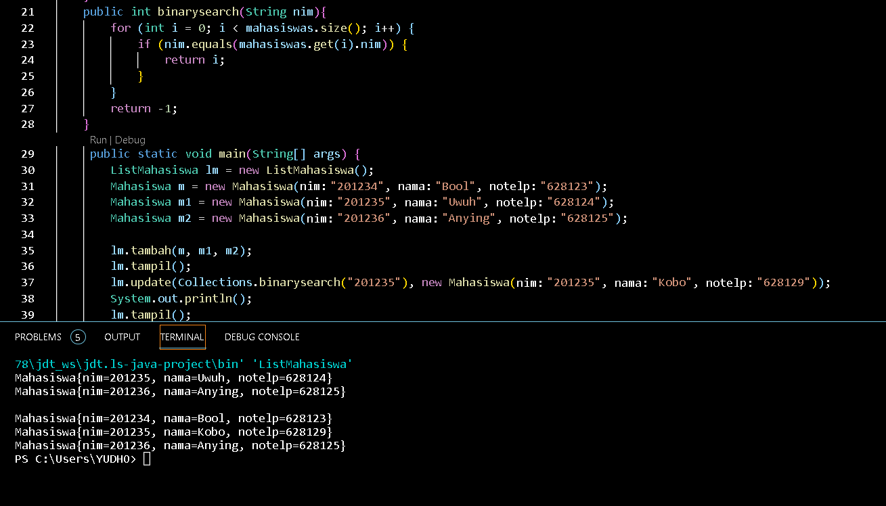
   
3. Tambahkan fungsi sorting baik secara ascending ataupun descending pada class tersebut!

   jawab:

   
   
   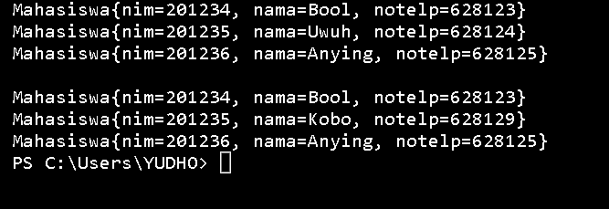

## **TUGAS PRAKTIKUM**

1. Tugas1

   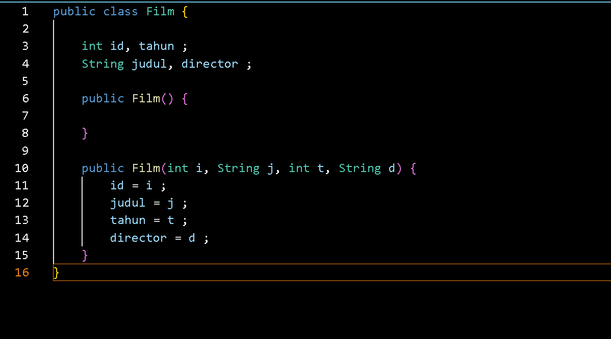
   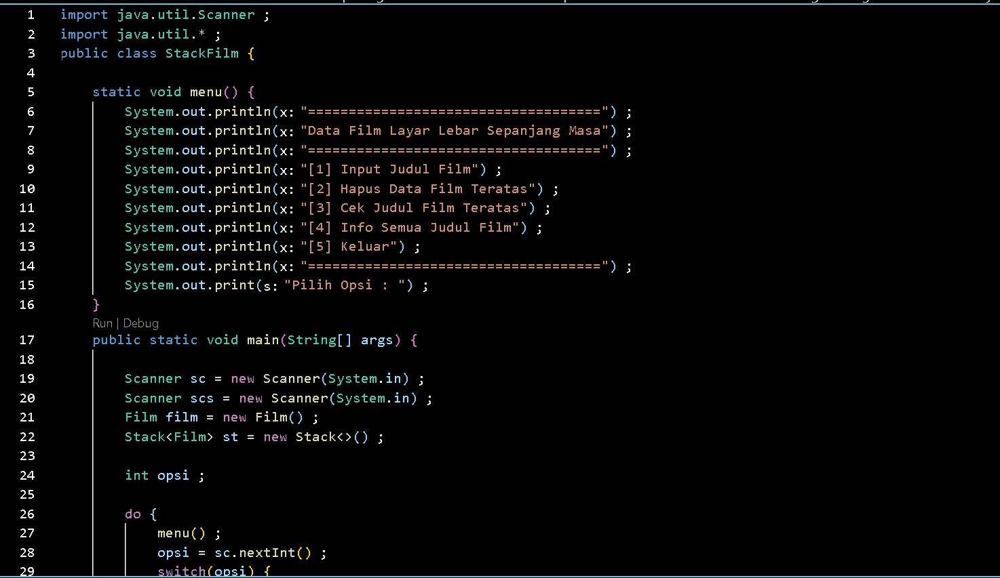
   
   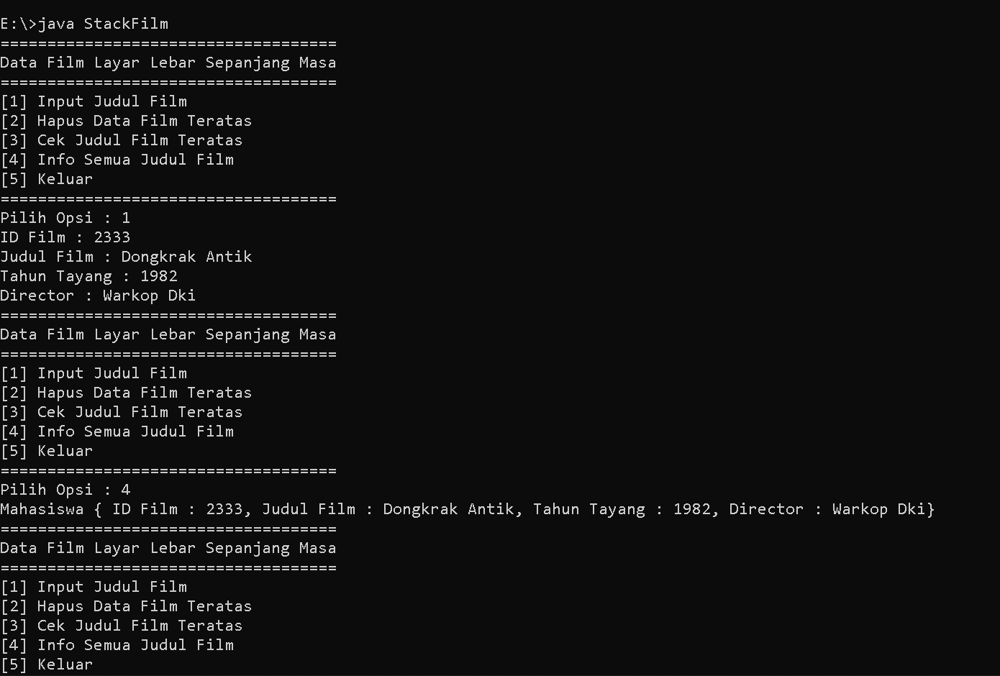
   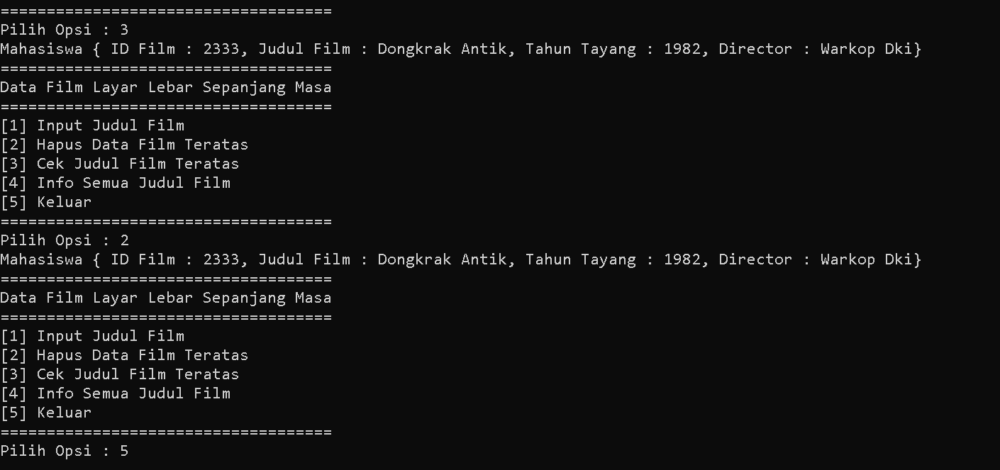

2. Tugas2

   
   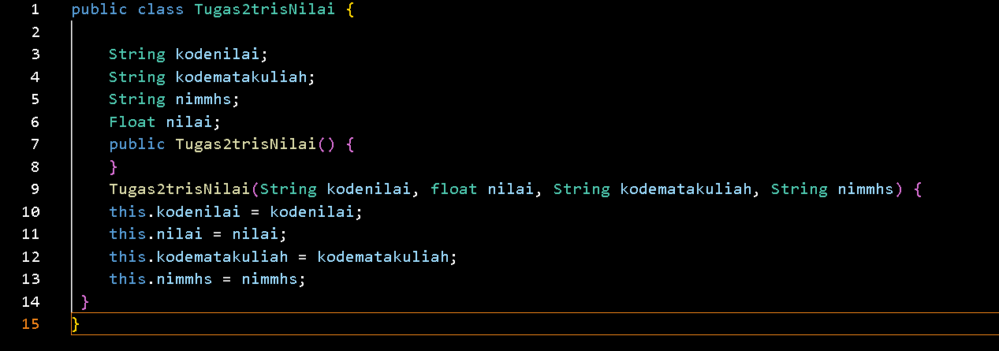
   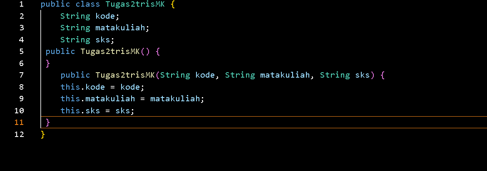
   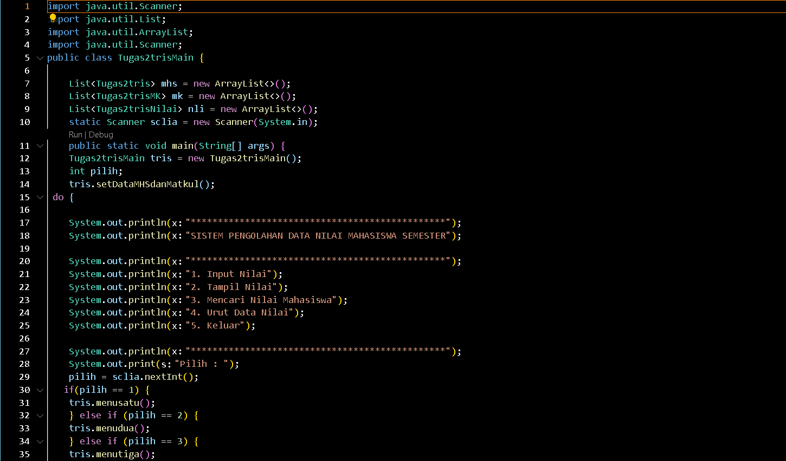
   
   
   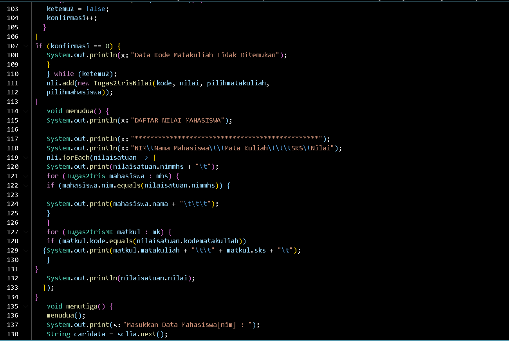
   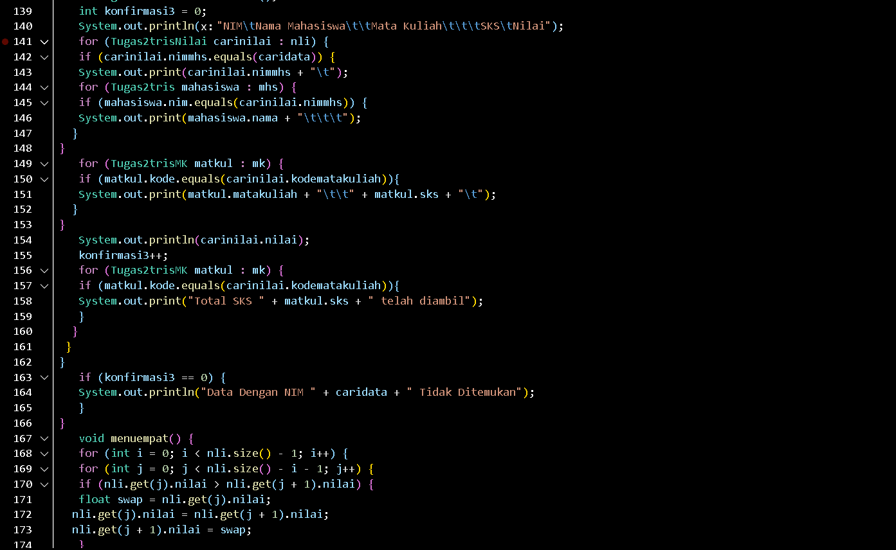
   
   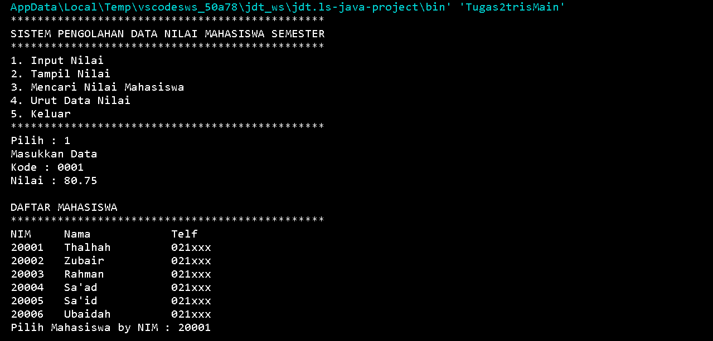
   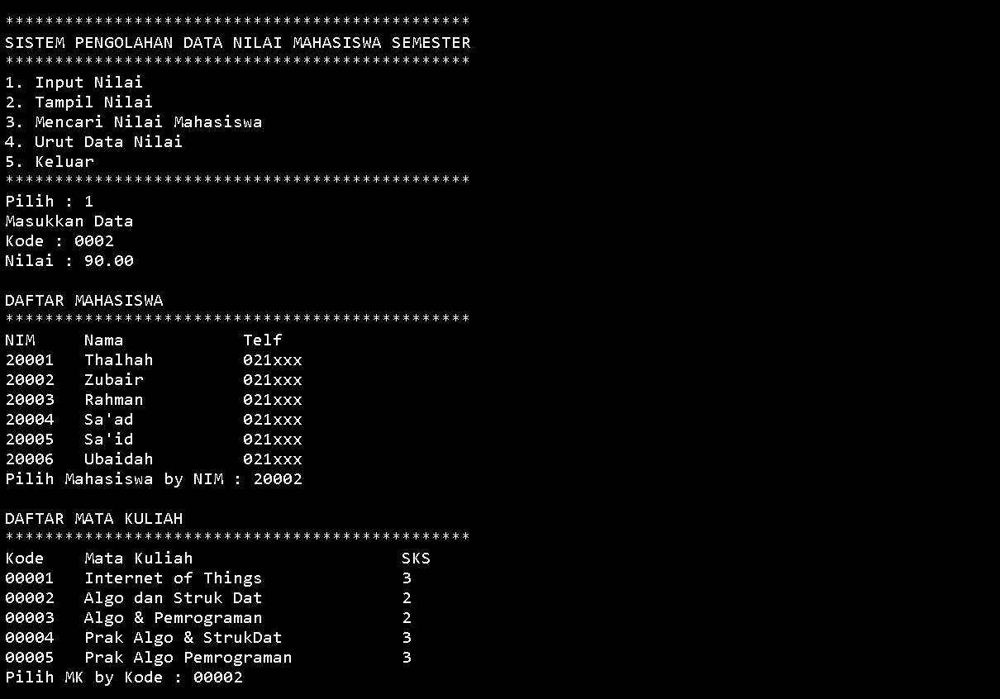
   
   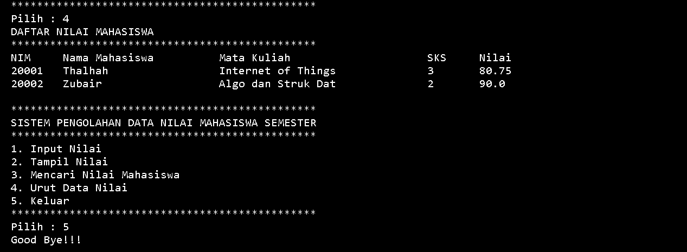

