##laporan Praktikum pertemuan 6
### Nama  : Trisinus Gulo
### NIM   : 2141720035
### Kelas : TI-1G
### Absen : 28

Langkah-langkah percobaan :

1. Buat Project baru, dengan nama “BruteForceDivideConquer”. Buat package dengan nama 
minggu5.

2. Buat class Faktorial:

3. Lengkapi class Faktorial dengan atribut dan method yang telah digambarkan di dalam 
diagram class di atas, sebagai berikut

4. Coba jalankan (Run) class Faktorial dengan membuat class baru MainFaktorial.

    a. Di dalam fungsi main sediakan komunikasi dengan user untuk menginputkan jumlah angka yang akan dicari nilai faktorialnya

    b. Buat Array of Objek pada fungsi main, kemudian inputkan beberapa nilai yangakan 
       dihitung faktorialnya

    c. Tampilkan hasil pemanggilan method faktorialDC() dan faktorialBF()

Verifikasi Hasil Percobaan 1

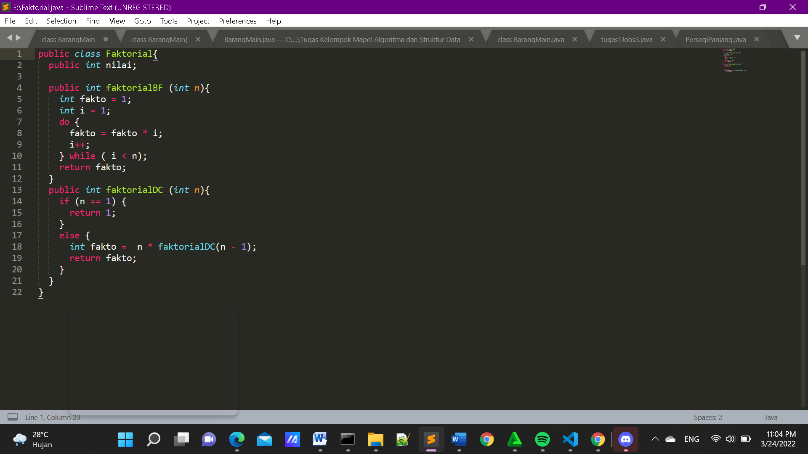
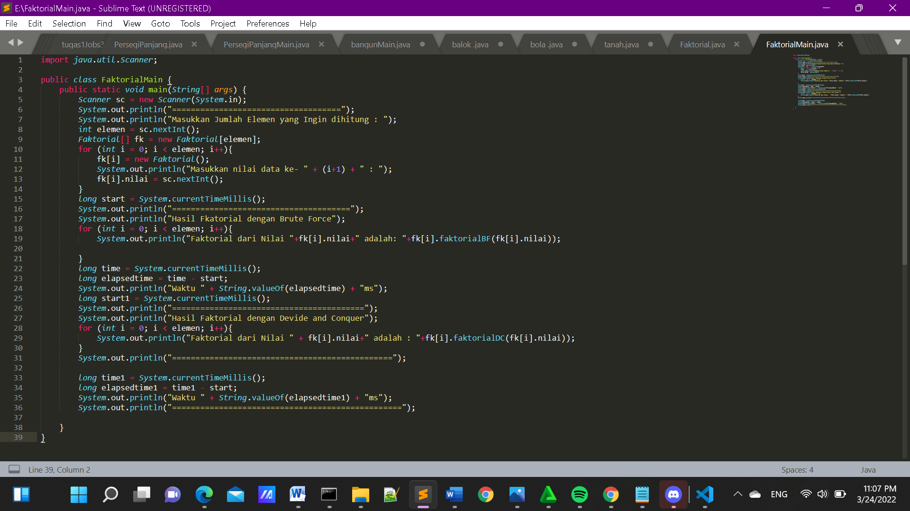
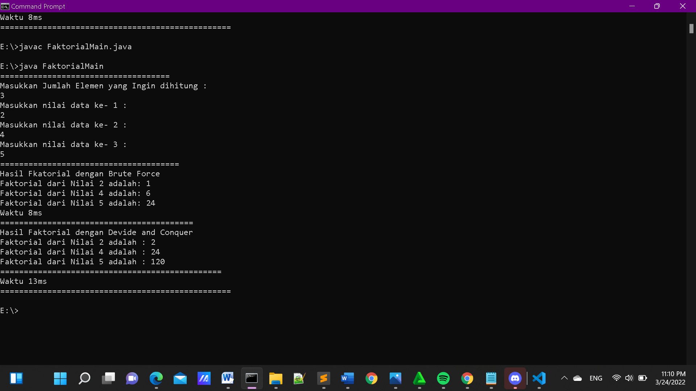

### ** Subbab 3.2.3 **
Pertanyaan:

1. Jelaskan mengenai base line Algoritma Divide Conquer untuk melakukan pencarian nilai faktorial!

jawab:

if (n == 1) {
	return 1;
}

Karena jika nilai dari n sudah equals atau sama dengan1, maka program akan 
melakukan return 1, kemudian jika tidak maka nilai daripada variable n akan di kurang -
1,yang mana di setiap loop atau perulangan yang di lakukan pada method di kalikan 
dengan nilai sebelumnya dan kemudian program akan mereturn pada variable fakto

2. Pada implementasi Algoritma Divide and Conquer Faktorial apakah lengkap terdiri 
dari 3 tahapan divide, conquer, combine? Jelaskan masing-masing bagiannya pada kode 
program!

jawab:

• Divide = faktorialDC(n-1) pengurangan pada nilai n. 

• Conquer = n*.faktorialDC(n-1) penyelesaian dengan rekursif. 

• Combine = n*faktorialDC(n-1) pengombinasian dengan perkalian. 

3. Apakah memungkinkan perulangan pada method faktorialBF() dirubah selain 
menggunakan for?Buktikan!

jawab:

Memungkinkan ,perulangan pada method faktorialBF() dirubah selain 
menggunakan for dapat juga di rubah menjadi perulangan jenis while maupun do 
while.

4. Tambahkan pegecekan waktu eksekusi kedua jenis method tersebut

jawab:

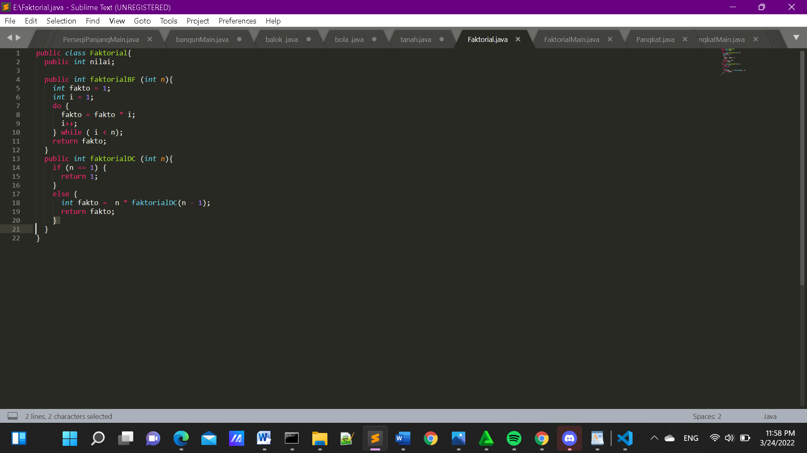
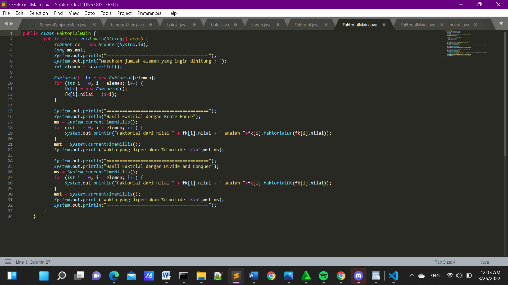

5.  Buktikan dengan inputan elemen yang di atas 20 angka, apakah ada perbedaan waktu 
eksekusi?

jawab:

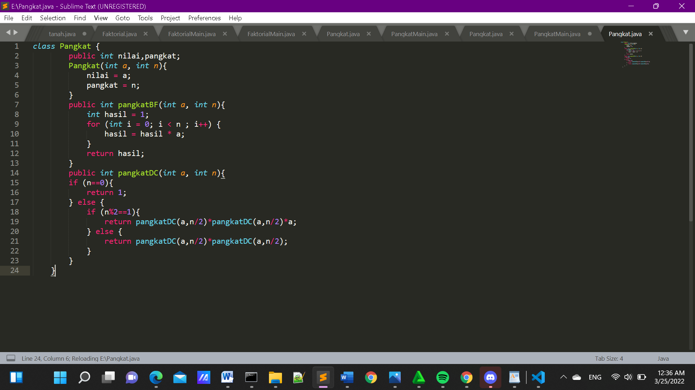

Ada perbedaan waktu saat eksekusi, tetapi Beberapa hasil faktorial tidak tepat karena melebihi batas dari integer.

### Subbab ** 4.3.1 **
 Langkah-langkah Percobaan 2

 1. Di dalam paket minggu5, buatlah class baru dengan nama Pangkat. Dan  di dalam class Pangkat tersebut, buat atribut angka yang akan dipangkatkan sekaligus dengan angka pemangkatnya.

 2. Pada class Pangkat tersebut, tambahkan method PangkatBF()

 3. Pada class Pangkat juga tambahkan method PangkatDC()

 4. Perhatikan apakah sudah tidak ada kesalahan yang muncul dalam pembuatan class Pangkat.

 5. Selanjutnya buat class baru yang di dalamnya terdapat method main. Class tersebut dapat dinamakan MainPangkat. Tambahkan kode pada class main untuk menginputkan jumlah nilai 
yang akan dihitung pangkatnya.

6. Nilai pada tahap 5 selanjutnya digunakan untuk instansiasi array of objek. Di dalam Kode berikut ditambahkan proses pengisian beberapa nilai yang akan dipangkatkan sekaligus dengan pemangkatnya.

7. Kemudian, panggil hasil nya dengan mengeluarkan return value dari method PangkatBF() dan PangkatDC().

Verifikasi Hasil Percobaan 2

### ** Subbab 4.3.3 **
Pertanyaan:

1. Jelaskan mengenai perbedaan 2 method yang dibuat yaitu PangkatBF() dan PangkatDC()!

jawab:

Perbedaan dari method PangkatBF() dan PangkatDC yakni pada method pangkatBF() menggunakan fungsi iterative (fungsi yang melakukan perulangan yang melakukan proses perulangan terhadap sekelompok intruksi. Perulangan dilakukan dalam batasan syarat tertentu. Ketika syarat tersebut tidak terpenuhi lagi maka perulangan akan terhenti.). Sedangkanpada method pangkatDC() menggunakan fungsi rekursif yang 
mana pada fungsi ini perulangan yang terjadi akibat pengeksekusian suatu fungsi yang mana fungsi tersebut memanggil dirinya sendiri. 

2. Pada method PangkatDC() terdapat potongan program sebagai berikut

jawab:

Maksud dari potongan tersebut yakni apabila terdapat suatu bilangan ganjil maka program akan melakukan pembagian terhadap variuable n, yakni di bagi 2 kemudian dikalikan dengan method itu sendiri dan kemudian di kalikan lagi dengan variable a. namun apabila terdapat suatu bilangan genap maka program akan melakukan return/nilai balik dan di dalam return tersebut dilakukan pembagian terhadap variable 
n, yang mana variable n di bagi 2 dan kemudian di kalikan dengan method itu sendiri namun tidak dikalikan dengan nilai daripada variable a.

3. Apakah tahap combine sudah termasuk dalam kode tersebut?Tunjukkan!

jawab:

Tahap combine sudah terjadi pada kode tersebut, dan lebih tepatnya tahapan tersebut di lakukan pada class Pangkat yang mana lebih tepatnya terletak pada method pangkatDC dan berada di baris kode ke 46, seperti pada gambar di bawah ini : 

4. Modifikasi kode program tersebut, anggap proses pengisian atribut dilakukan dengan konstruktor.

jawab:

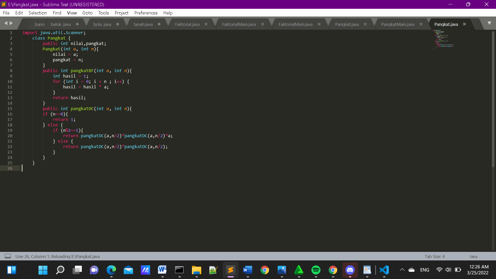
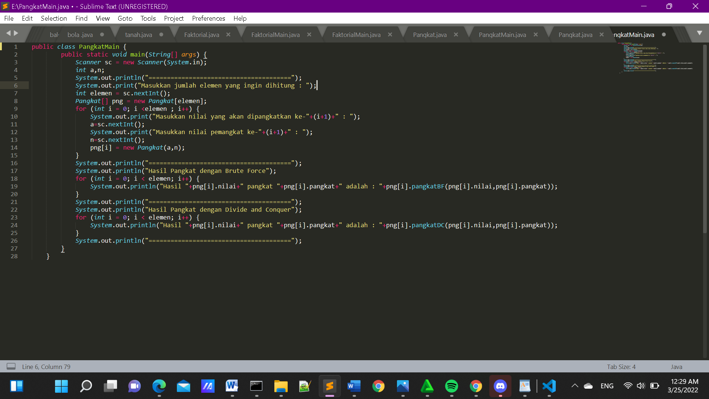

5. Tambahkan menu agar salah satu method yang terpilih saja yang akan dijalankan!

jawab:

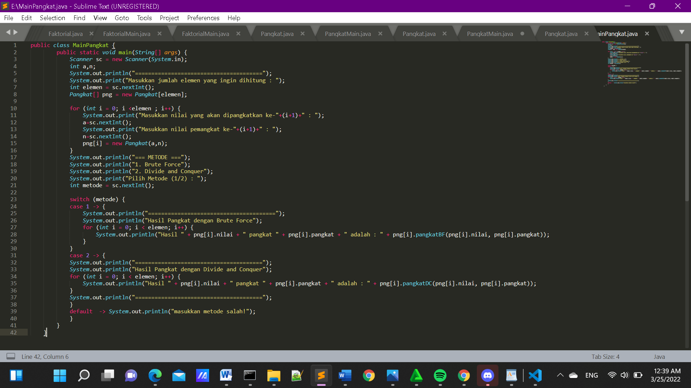

###  Subbab ** 4.4**
Menghitung Sum Array dengan Algoritma Brute Force dan Divide and Conquer

### Subbab ** 4.4.1**
Langkah-langkah Percobaan

1. Pada paket minggu5. Buat class baru yaitu class Sum. DI salam class tersebut terdapat beberapa atribut jumlah elemen array, array, dan juga total. Tambahkan pula konstruktor pada class Sum.

2. Tambahkan method TotalBF() yang akan menghitung total nilai array dengan cara iterative.

3. Tambahkan pula method TotalDC() untuk implementasi perhitungan nilai total array menggunakan algoritma Divide and Conquer.

4. Buat class baru yaitu MainSum. Di dalam kelas ini terdapat method main. Pada method ini user dapat menuliskan berapa bulan keuntungan yang akan dihitung. Dalam kelas ini sekaligus dibuat instansiasi objek untuk memanggil atribut ataupun fungsi pada class Sum.

5. Karena yang akan dihitung adalah total nilai keuntungan, maka ditambahkan pula pada method main mana array yang akan dihitung. Array tersebut merupakan atribut yang terdapat di class 
Sum, maka dari itu dibutuhkan pembuatan objek Sum terlebih dahulu.

6. Tampilkan hasil perhitungan melalui objek yang telah dibuat untuk kedua cara yang ada (Brute Force dan Divide and Conquer)

Verifikasi Hasil Percobaan 3

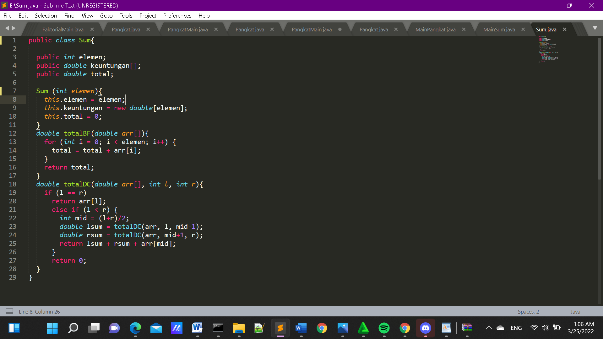
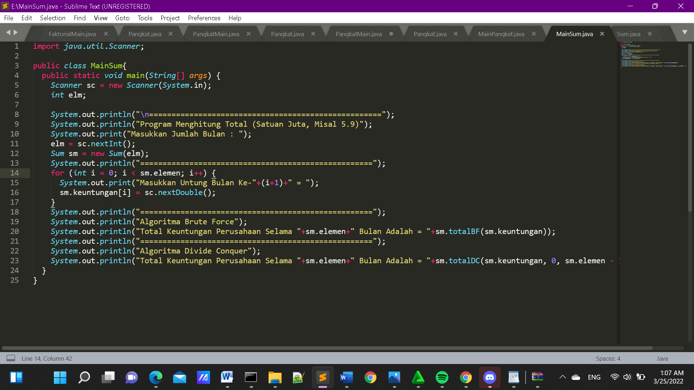
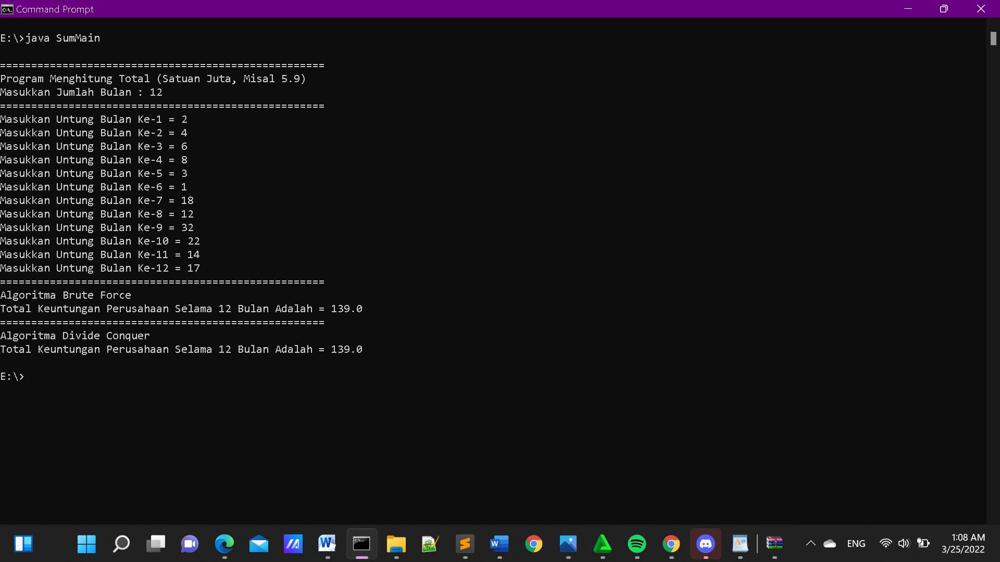

### ** Subbab 4.4.3 **
Pertanyaan

1. Berikan ilustrasi perbedaan perhitungan keuntungan dengan method TotalBF() ataupun TotalDC()

jawab:

a. Perbedaan perhitungan yang terjadi pada method TotalBF() yakni, kode 
program terkesan lebih ringkas dan sederhana, dan menjadikannya lebih mudahuntuk di pahami kemudian menghasilkan algoritma yang standard untuk  tugas 
tugas komputasi. 

b. Perbedaan perhitungan yang terjadi pada method TotalDC() yakni, kode 
program lebih panjang daripada kode program pada method TotalBF(),namun 
method ini memiliki keuntungan yang mana pada method ini kita dapat 
memecahkan masalah atau case yang sulit kemudian juga memiliki efisiensi 
algoritma yang tinggi dan juga pada method ini memiliki sistemkerja parallel. 

2. Perhatikan output dari kedua jenis algoritma tersebut bisa jadi memiliki hasil berbeda di belakang koma. Bagaimana membatasi output di belakang koma agar menjadi standar untuk kedua jenis algoritma tersebut

jawab:

Dengan cara mengganti syntax println menjadi syntax printf dan juga teknik pembatasan karakter, caranya yakni dengan mengetikkan kode program dibawah ini 
:
System.out.printf("%2f", "Total keuntungam selama 
"+sm.elemen+" bulan adalah : "+sm.totalBF(sm.keuntungan));

3. Mengapa terdapat formulasi return value berikut?Jelaskn

jawab:

Return value tersebut berguna untuk mengembalikan nilai dari variable lsum 
,variable rsum dan juga arr [mid] yang mana masing-masing nya di jumlah kan terlebih dahulu.

4. Kenapa dibutuhkan variable mid pada method TotalDC()?

jawab:

Di butuhkan variable mid pada method TotalDC() yakni guna menampng nilai 
dari perhitungan (1+r)/2 yang mana nantinya akan gi gunakan sebagai pengisian nilai pada parameter di method TotalDC() 

5. Program perhitungan keuntungan suatu perusahaan ini hanya untuk satu perusahaan saja. Bagaimana cara menghitung sekaligus keuntungan beberapa bulan untuk beberapa perusahaan.(Setiap perusahaan bisa saja memiliki jumlah bulan berbeda-beda)? Buktikan dengan program!

jawab:

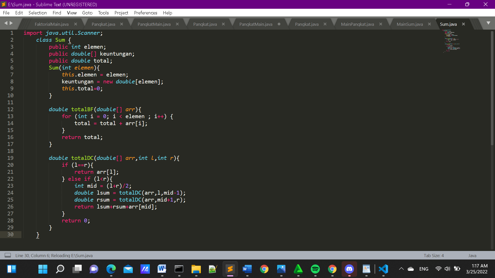
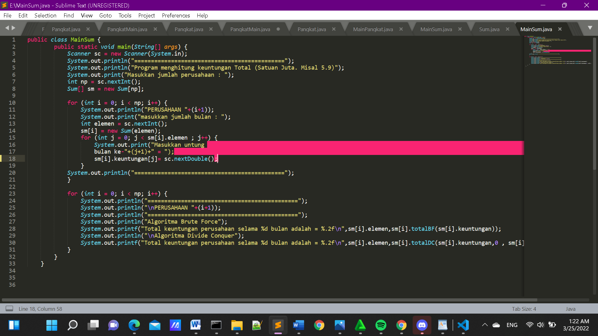

*** Latihan Praktikum ***

Tugas 1

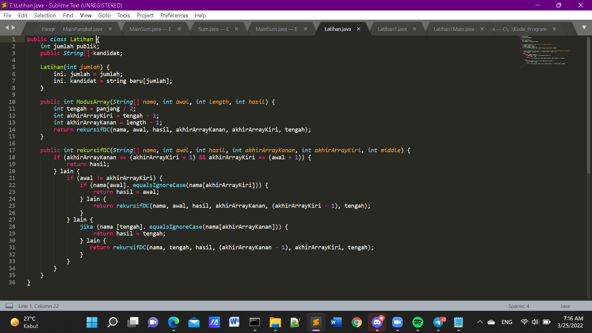
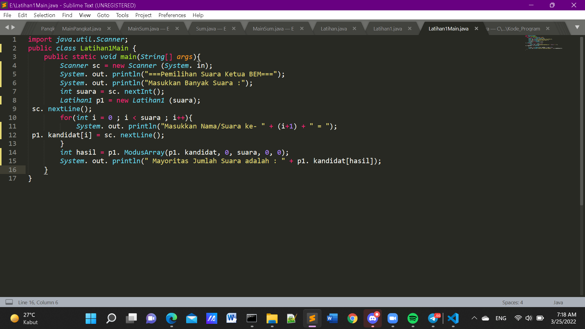
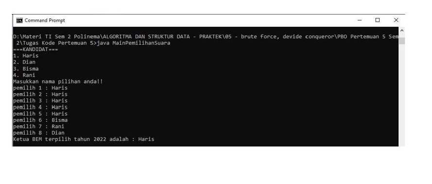

