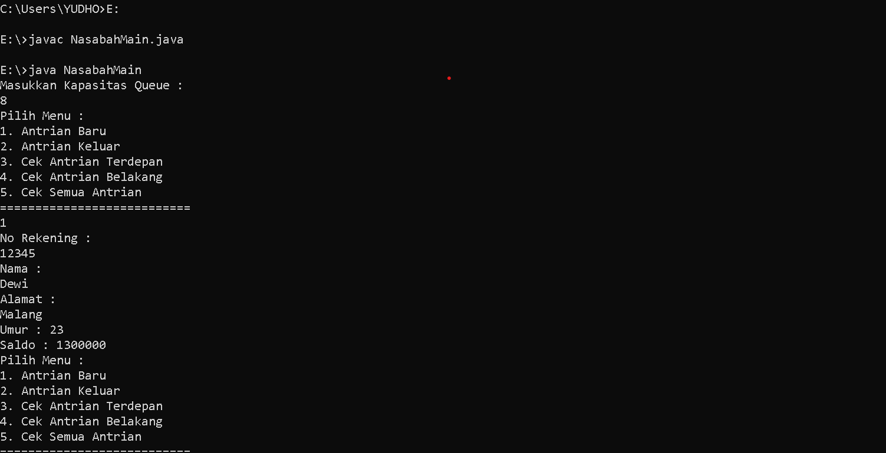

##laporan Praktikum pertemuan 10
### Nama  : Trisinus Gulo
### NIM   : 2141720035
### Kelas : TI-1G
### Absen : 28

## **8.1 Praktikum1**

## **Pertanyaan Praktikum1**

1. Pada konstruktor, mengapa nilai awal atribut front dan rear bernilai -1, sementara atribut size bernilai 0?
   
   jawab:
   Data awal diasumsikan masih kosong. Jadi kode tersebut menginisialisasikan front = rear= -1 tidak menunjuk pada indeks manapun karena queue masih kosong.

2. Pada method Enqueue, jelaskan maksud dan kegunaan dari potongan kode berikut!

   jawab:

   Jadi jika rear terletak pada indeks terakhir. Maka jumlah elemen maksimal Queue -1, maka posisi rear queue kembali ke indeks 0.

3. Pada method Enqueue, jelaskan maksud dan kegunaan dari potongan kode berikut!

    jawab :

    Apabila rear berada pada indeks paling belakang maka rear akan dipindahkan ke indeks paling depan

4. Pada method print, mengapa pada proses perulangan variabel i tidak dimulai dari 0(int i =0), melainkan int i =front?

    jawab:

    Ya karena bisa saja indeks terdepan bukan indeks 0, indeks terdepan adalah front jadi yang di tampilkan adalah dimulai dari indeks front

5. Perhatikan kembali method print, jelaskan maksud dari potongan kode berikut!
   
   jawab: Potongan kode diatas digunakan agar i tidak melebihi max

6. Tunjukkan potongan kode program yang merupakan queue overflow!
   
   jawab:

   if (IsFull()) {

    System.out.println ("Queue sudah penuh");
}

7. Pada saat terjadi queue overflaw dan queue underflow, program tersebut tetap dapat berjalan dan hanya menampilkan teks informasi. Lakukan modifikasi program sehingga pada saat terjadi queue overflow dan queue underflow, program dihentikan!
   
   jawab:

   
   
   
   

## **8.2 Praktikum2**

)

## **pertanyaan paraktikum2**

1. Pada class QueueMain, jelaskan fungsi IF pada potongan kode program berikut:

   if(!"".equals(data.norek) && !"".equals(data.nama) && !"".equals(data.alamat) && data.umur != 0 && data.saldo != 0){

   System.out.println("Antrian Yang Keluar : " + data.norek + " " + " " + data.nama + " " + data.alamat + " " + data.umur + " " + data.saldo);

   jawab 
   
   Kode program diatas digunakan untuk mengecek apakah norek, nama, alamat, umur, saldo kosong atau tidak, apabila salah satu dari kelima atribut tersebut ada yang kosong maka tidak akan menampilkan antrian yang keluar.

2. Lakukan modifikasi program dengan menambahkan method baru bernama peekRear pada class Queue yang digunakan untuk mengecek antrian yang berada di posisi belakang! Tambahkan pula daftar menu 5. Cek Antrian paling belakang pada class QueueMain sehinggamethod peekReardapat dipanggil!

   jawab :

   
   
   
   
   

## **TUGAS PRAKTIKUM**

1. Tugas1

   Tambahkan dua method berikut ke dalam class Queue pada Praktikum1:
   a. Method peekPosition(data:int):void
   Untuk menampilkan posisi dari sebuah data di dalam queue, misalnya dengan 
   mengirimkan data tertentu, akan diketahui posisi(indeks) data tersebut berada di
   urutan ke berapa

   b. Method peekAt(position:int):void
   Untuk menampilkan data yang berada pada posisi (indeks) tertentu
   Sesuaikan daftar menu yang terdapat pada class QueueMain sehingga kedua method 
   tersebut dapat dipanggil!
   Kode Program
     
     jawab:

     
     
     
     
     
     
     
     
   
2. Buatlah program antrian untuk mengilustrasikan mahasiswa yang sedang meminta tanda tangan KRS pada dosen DPA di kampus. Ketika seorang mahasiwa akan mengantri, maka dia harus menuliskan terlebih dulu NIM, nama, absen, dan IPK

   jawab:

   
   
   
   
   
   